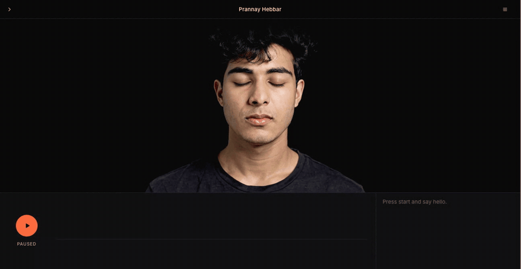
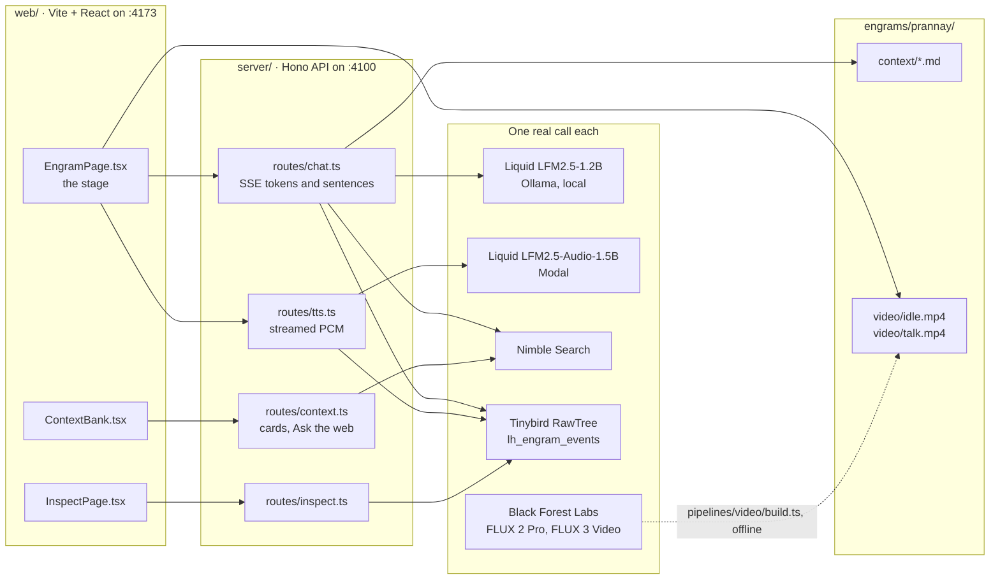
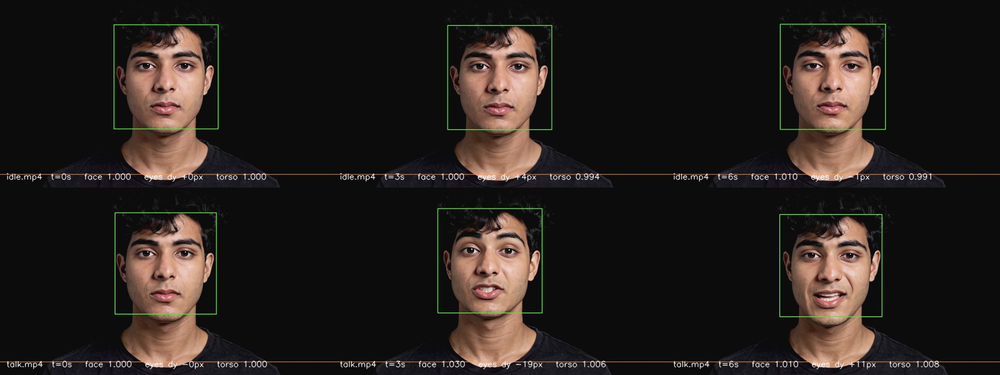
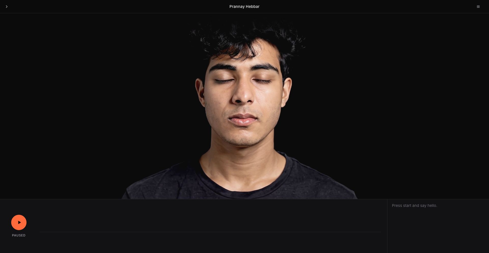
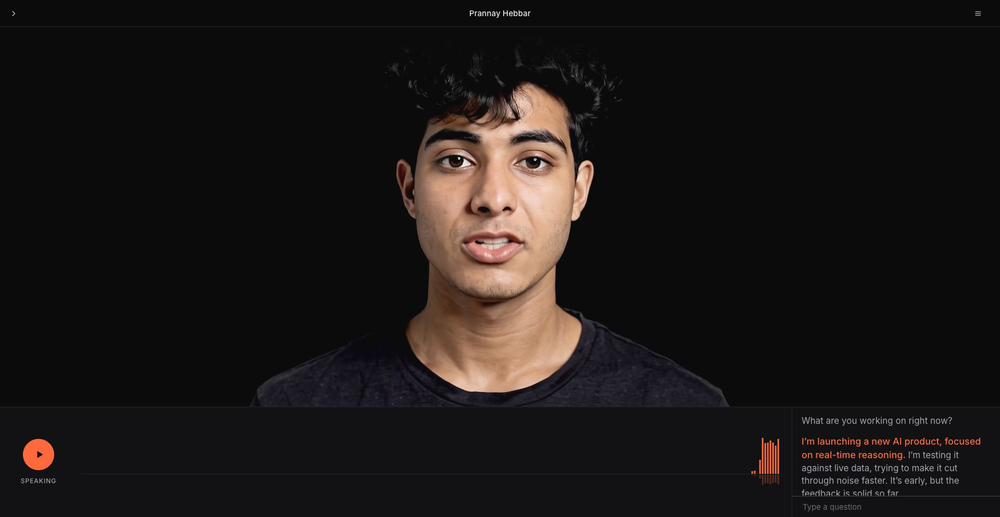
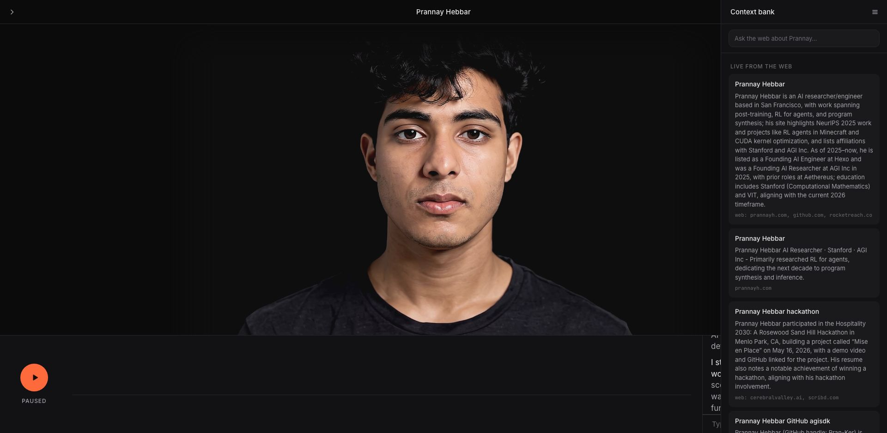
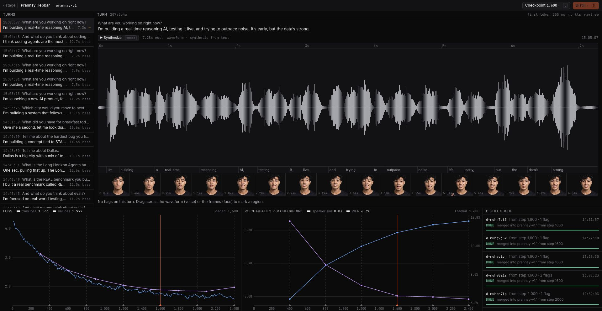

<h1 align="center">Engram</h1>

<p align="center">A person you can stand in front of and talk to: their face, their voice, and their memories.</p>

<p align="center">
  <code>Long Horizon Agents Hackathon · Sept 25, 2026</code> ·
  <a href="engram/README.md">app docs</a> ·
  <a href="engram/docs/api.md">API</a> ·
  <a href="engram/docs/adding-an-engram.md">add a person</a> ·
  <a href="voice/README.md">voice</a> ·
  <a href="dashboard/README.md">dashboard</a>
</p>

<p align="center">
  
</p>

**Figure 1.** One turn on the stage. You press `/`, type a question, and the face switches to the talking loop while the sentence being spoken lights up orange in the transcript.

You press start, ask a question out loud, and the person on screen answers in their own voice about a second and a half later. The words come from a folder of Markdown cards about them. When the question needs fresh facts, a live web search fills in the gap and writes what it found back into the folder as a new card. Every turn goes to a database that the agent reads back instead of carrying its history in context.

One engram is one folder: `engram.json`, `context/*.md`, `photos/`, `video/`. Adding a person is adding a folder. This repo ships one, `prannay`, built by Prannay Hebbar and Chinmay Hebbar in a day.

## How it fits together



**Figure 2.** The browser talks only to the API. The API reads the engram folder, calls one sponsor per job, and logs every turn to RawTree, which the Inspect page reads back. The video pipeline runs offline and writes the face clips into the same folder.

## What the stage answers

Real transcripts from `POST /api/engrams/prannay/chat`, taken while writing this page. The brain runs at a low temperature with a fixed seed, so the same wording gives the same answer, and the audio for each sentence is cached after the first ask.

> **Q** Who are you?
>
> **A** Prannay Hebbar. I'm 25, I do post-training research for agents, and I've been a founding engineer at two AI labs. Right now I'm starting my own company out of San Francisco.

> **Q** What are you working on right now?
>
> **A** Right now I'm at the Long Horizon Agents hackathon in San Francisco, demoing Engram: a talking version of me with my face, my voice, and my memories, built on Liquid, Black Forest Labs, Nimble and Tinybird. I left Hexo in July 2026 to start a company, and I'm raising a seed round.

> **Q** Where did you go to school?
>
> **A** I did my undergrad at VIT in Vellore, India, computer science and business systems, then a summer semester at Stanford in 2024: convex optimization with Stephen Boyd and high performance computing.

> **Q** How long were you at Hexo?
>
> **A** About seven months, December 2025 to July 2026.

> **Q** What do you think about AI safety?
>
> **A** I take the long-term risk seriously, but most of the discourse is stuck on distant existential scenarios. The useful work is making the capability development happening right now go right.

> **Q** Tell me the Uhaul story.
>
> **A** Dallas wasn't enough. I set my deadline to leave as the day of the Stanford Codex hackathon, packed everything into a Uhaul, drove to SF and lived in hostels. That's the real inflection point in my story, not any paper.

Off-script questions are answered from the context cards by a 1.2B model. It stays close on facts the cards state plainly and drifts on open-ended ones. An embedding router matches a question against a bank of Q&A pairs written in Prannay's voice first, and the model abstains rather than guessing when nothing matches.

## The face

Six photos from a camera roll went in. FLUX 2 Pro turned them into a studio portrait, FLUX Kontext blackened the backdrop to the page color, and FLUX 3 Video turned the portrait into two loops: idle and talking. The stage crossfades between them.

<p align="center">
  
</p>

**Figure 3.** Idle loop on the left, talking loop on the right. The talking loop was re-rendered with a locked-off camera so the face stays the same size across the loop and the crossfade does not pop.

<p align="center">
  
</p>

**Figure 4.** Scale check written by the video pipeline: frames at 0, 3, and 6 seconds of both loops with the detected face box. Face scale stays within 3 percent, which is what makes the switch between loops invisible.

Every render, with its prompt, parameters, task id, and cost, is one line in `engram/pipelines/video/runs.jsonl`.

## The stage

<table>
  <tr>
    <td width="50%"></td>
    <td width="50%"></td>
  </tr>
  <tr>
    <td><b>Idle.</b> Start button, hairline voice bar, transcript column. The text input stays hidden until you press <code>/</code>.</td>
    <td><b>Speaking.</b> The voice bar draws the playback waveform. The sentence being spoken is orange.</td>
  </tr>
  <tr>
    <td width="50%"></td>
    <td width="50%"></td>
  </tr>
  <tr>
    <td><b>Context bank</b> (<code>]</code>). The cards the brain answers from. Cards used in the last answer get an orange left border; live Nimble results sit at the top.</td>
    <td><b>Inspect</b> (<code>I</code>). DevTools for a person: every turn from RawTree, a waveform you drag across to flag a voice region, and the fine-tune loss curves.</td>
  </tr>
</table>

**Figure 5.** The four screens. Space starts and pauses, `[` opens the list of engrams, `]` the context bank, `/` the text input, `I` the Inspect page, and Esc closes panels.

What happens on one turn:

1. The browser sends the transcript to `POST /api/engrams/:slug/chat`.
2. The server picks the most relevant cards, adds the persona, and streams tokens from Ollama over Server-Sent Events. If the question needs fresh facts, it first says a short filler sentence and runs a Nimble search.
3. On each sentence boundary the browser opens `POST /api/engrams/:slug/tts/stream` and plays the PCM as it arrives, so speech starts while the model is still writing.
4. When the answer ends, the server writes a memory card for the session and logs the turn to RawTree.

| Moment | Fresh question | Cached question |
|---|---|---|
| First draft text on screen | 0.4 to 0.6 s | 0.4 to 0.6 s |
| First spoken word | 2.7 to 3.3 s | about 1.4 s |
| Web question, filler starts | 0.7 s | |
| Web question, answer starts | about 8 s | |

Timings measured on the stage on Sept 25, 2026. Voice generation runs at about 0.8x real time on Modal, so streaming with a head-start buffer is what makes it feel live.

## The four sponsors

Every sponsor is a real call in the request path, not a logo.

| Sponsor | What it does here | Where |
|---|---|---|
| Liquid AI | Brain: `LFM2.5-1.2B-Instruct` runs locally through Ollama and answers as the person. Voice: `LFM2.5-Audio-1.5B`, streamed sentence by sentence from Modal, with a fine-tune on the person's recordings behind it. | `engram/server/lib/liquid.ts`, `voice/` |
| Black Forest Labs | Face: `flux-2-pro` for the portrait, `flux-kontext-pro` for the backdrop, `flux-3-video` for the idle and talking loops. | `engram/pipelines/video/` |
| Nimble | Live context: the **Ask the web** field in the context bank, and an automatic search when a question mentions today, the hackathon, news, or a date. | `engram/server/lib/nimble.ts` |
| Tinybird RawTree | Memory and analytics: every utterance, first token, TTS call, fallback, and flag is a row in `lh_engram_events`. The Inspect page reads its turn list from there. | `engram/server/lib/rawtree.ts` |

`GET /api/health` reports all four plus Ollama in one JSON object.

| By the numbers | |
|---|---|
| FLUX renders to get one face | 39, for $23.39 |
| Context cards in `engrams/prannay/context/` | 37 |
| Q&A pairs in Prannay's voice | 282 |
| First spoken word, cached question | about 1.4 s |

## Run it

Before you start, you need Node 22, [Ollama](https://ollama.com), `ffmpeg`, `uv`, and the `modal` CLI. Keys live in `~/.local/secrets` and are never written into the repo: `NIMBLE_API_KEY`, `BFL_API_KEY`, `RAWTREE_API_KEY`, `MODAL_TOKEN_ID`, `MODAL_TOKEN_SECRET`.

1. Pull the brain model into Ollama:

   ```bash
   ollama pull hf.co/LiquidAI/LFM2.5-1.2B-Instruct-GGUF:Q4_K_M
   ```

2. Deploy the voice service on Modal. This writes `voice/.tts-url`, which the API reads on each request:

   ```bash
   cd voice && make deploy && cd ..
   ```

3. Install and start both dev servers:

   ```bash
   source ~/.local/secrets
   cd engram
   npm install
   npm run dev
   ```

   The API listens on `http://localhost:4100` and the web app on `http://localhost:4173`, which proxies `/api` to the API.

4. Open `http://localhost:4173/e/prannay` and check `http://localhost:4100/api/health`. Every entry should read `"ok": true`.

When you are done, run `make tts-stop` in `voice/`. The voice service keeps three L4 containers warm at about $2.40 per hour in total.

To add a person, follow [Adding an engram](engram/docs/adding-an-engram.md). To skip the hand-written folder and build one from a research record plus a photo, see [direct mode](engram/docs/direct-mode.md) and the [dashboard](dashboard/README.md).

## Repo layout

```
engram/       The app. server/ is the Hono API, web/ is the stage, engrams/<slug>/ is one person,
              pipelines/video/ builds the face, docs/ holds the API reference and pipeline docs.
voice/        LFM2.5-Audio fine-tune: browser recorder, Modal training app, TTS service.
dashboard/    Direct-mode front door: Nimble research on a name, FLUX 3 talking clip, one click to the stage.
hackathon/    Sponsor smoke test (npm run check), submission copy, and the day's notes.
docs/img/     Media for this page.
```

## Read next

- [App docs](engram/README.md): the stage, the Inspect page, the review loop, and the demo script.
- [Adding an engram](engram/docs/adding-an-engram.md): the folder contract, recording a voice, and building a face.
- [API reference](engram/docs/api.md): every route with request and response shapes.
- [Video pipeline](engram/docs/video-pipeline.md) and [voice pipeline](engram/docs/voice-pipeline.md): how the face and the voice are made.
- [Hackathon notes](hackathon/NOTES.md): sponsor setup, keys, judging criteria.
