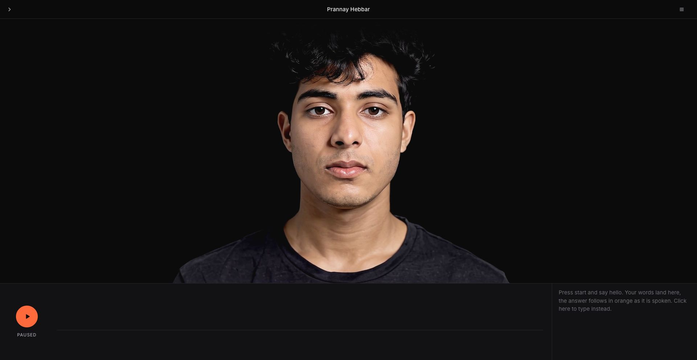
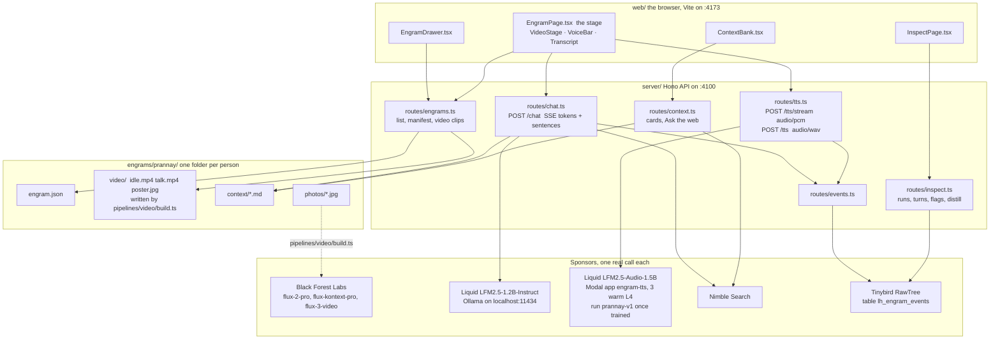
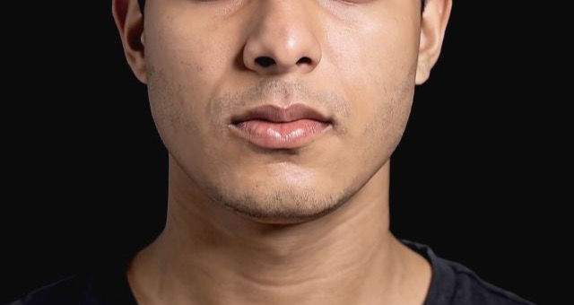
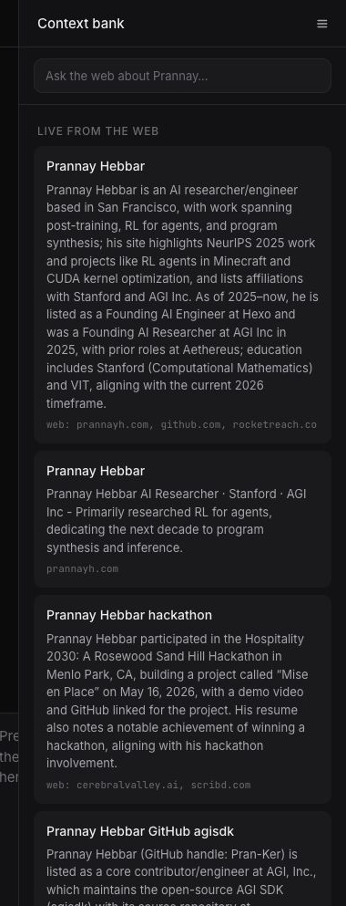
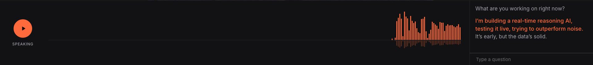
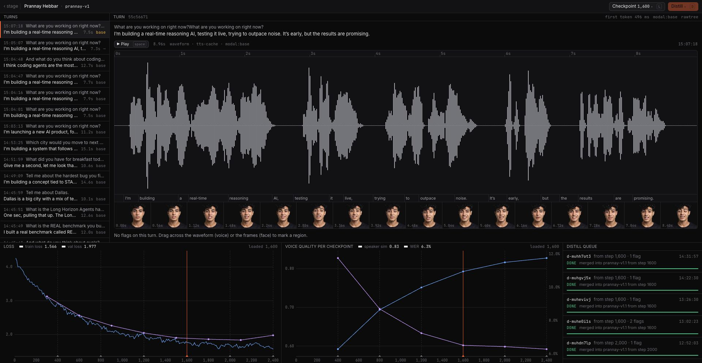

# Engram

An Engram is a person you can stand in front of and talk to: their face, their voice, and their memories. You press start, ask a question out loud, and the person on screen starts answering in their own voice about a second and a half later, drawing on a context bank of notes about them and, when the question needs fresh facts, on a live web search. One Engram is one folder under `engrams/`. This repo ships one, `prannay`, built for the Long Horizon Agents Hackathon (September 25, 2026).



**Figure 1.** The stage at 1920x993. Drawer toggle at the top left, context bank toggle at the top right, start button, voice bar, and transcript in the 212 px bottom bar.

## How it fits together



**Figure 2.** The four layers. The browser talks only to the API. The API reads the engram folder, calls one sponsor per job, and writes every turn to RawTree, which the Inspect page reads back. The video pipeline runs offline and writes into the same folder.

The wire types live in `shared/types.ts` and the route table in `docs/CONTRACTS.md`.

## The four sponsors

Every sponsor is a real call in the request path, not a logo.

| Sponsor | What it does here | Where |
|---|---|---|
| Liquid AI | Brain: `LFM2.5-1.2B-Instruct` runs locally through Ollama and answers as the person, one to three spoken sentences per turn. Voice: `LFM2.5-Audio-1.5B` fine-tuned on the person's recordings, streamed sentence by sentence from Modal. | `server/lib/liquid.ts`, `../voice/` |
| Black Forest Labs | Face: `flux-2-pro` turns reference photos into a studio portrait, `flux-kontext-pro` blackens its backdrop when needed, and `flux-3-video` (`mode: i2v`) turns the portrait into an idle loop and a talking loop. | `pipelines/video/` |
| Nimble | Live context: the **Ask the web** field in the context bank, and the brain runs a Nimble search when a question mentions today, the hackathon, news, or a date. | `server/lib/nimble.ts` |
| Tinybird RawTree | Memory and analytics: every utterance, first token, TTS call, fallback, and flag is a row in `lh_engram_events` (database `default`). The Inspect page reads its turn list from there. | `server/lib/rawtree.ts` |

`GET /api/health` reports all four plus Ollama in one JSON object.

## Two modes

The folder above is the **hyper-personalized** path: hand-written notes, a fine-tuned voice, a face built from many photos. The same server also runs **direct avatar engrams**: `POST /api/direct/engrams` turns one research record (a lead-enrichment CSV row, say) plus one photo and an optional talking clip into a complete folder, answered by Liquid `LFM2.5` on OpenRouter instead of local Ollama. The stage, the context bank, live web lookups and event logging are shared; only the way the folder is made and which Liquid endpoint answers differ. See [`docs/direct-mode.md`](docs/direct-mode.md).

## Run it

Before you start, you need Node 22, [Ollama](https://ollama.com), `ffmpeg`, `uv`, and the `modal` CLI. Keys live in `~/.local/secrets` and are never written into the repo: `NIMBLE_API_KEY`, `BFL_API_KEY`, `RAWTREE_API_KEY`, `MODAL_TOKEN_ID`, `MODAL_TOKEN_SECRET`.

1. Pull the brain model into Ollama:

   ```bash
   ollama pull hf.co/LiquidAI/LFM2.5-1.2B-Instruct-GGUF:Q4_K_M
   ```

2. Deploy the voice service on Modal. This writes `../voice/.tts-url`, which the API reads on each request:

   ```bash
   cd ../voice && make deploy && cd ../engram
   ```

   The service keeps three L4 containers warm (`ENGRAM_TTS_WARM`) at about $2.40 per hour in total. Run `make tts-stop` in `../voice` when you are done.

3. Install and start both dev servers:

   ```bash
   source ~/.local/secrets
   npm install
   npm run dev
   ```

   The API listens on `http://localhost:4100` and the web app on `http://localhost:4173`, which proxies `/api` to the API.

4. Open `http://localhost:4173/e/prannay` and check `http://localhost:4100/api/health`. Every entry should read `"ok": true`.

Optional: rebuild the face with `npm run video:build -- prannay`. See [Adding an engram](docs/adding-an-engram.md) for the full pipeline.

To typecheck everything, run `npm run check`.

### Environment variables

All optional. Defaults are in parentheses.

| Variable | Purpose |
|---|---|
| `PORT` | API port (`4100`) |
| `ENGRAMS_DIR` | Folder of engrams (`engrams`) |
| `OLLAMA_URL`, `LIQUID_MODEL` | Ollama endpoint and model tag override |
| `ENGRAM_TTS_URL` | Voice service URL; overrides `../voice/.tts-url` |
| `ENGRAM_TTS_LOCAL` | Set to `0` to disable the macOS `say` fallback (dev only; never on stage) |
| `ENGRAM_EVENTS_URL` | Where the TTS route posts its own events (`http://localhost:4100/api/events`) |
| `ENGRAM_MEMORY` | Set to `off` to stop the brain from saving memory cards after conversations (default on; a turn is saved only when it used a non-memory card and names something from the notes) |
| `TTS_CACHE_DIR` | Cache of synthesized wavs (`review/tts-cache`) |
| `RAWTREE_DATABASE` | RawTree database (`default`) |
| `VOICE_DIR` | Where the Inspect page looks for `checkpoints/` (`../voice`) |

## Using the stage

The stage has four controls and six keys. Keys do nothing while you are typing in a field.

| Control | Key | What happens |
|---|---|---|
| Start / Pause (the orange button) | Space | Start asks for the microphone and begins listening. Pause stops listening and speaking but keeps the transcript. |
| Text input | `/` | Reveals a **Type a question** field under the transcript and focuses it. Clicking anywhere on the transcript does the same, and the field appears on its own when the microphone fails. Esc hides it. |
| Drawer toggle (top left) | `[` | Lists every engram with three readiness marks: voice, face, context. The last row explains how to add one. |
| Context bank toggle (top right) | `]` | Opens the cards the brain answers from, grouped by section. |
| Inspect | `I` | Opens `/inspect/:slug`. |
| Close panels | Esc | Closes the drawer and the bank. |

The bottom bar is 212 px tall. The voice bar is a hairline while nothing is playing, grey bars while the microphone listens, and orange bars while the engram speaks. The transcript keeps your last question pinned at the top of its column, sets its text at 17 px, and shows the sentence being spoken at 18 px in orange.



**Figure 3.** The drawer. Each row is one folder under `engrams/`; the marks come from `GET /api/engrams`.



**Figure 4.** The context bank. Sections are Live from the web, Profile, Story, Work, Opinions, How he talks, and Memories. Cards used in the last answer get an orange left border for four seconds.



**Figure 5.** The bottom bar while answering a typed question. The sentence being spoken turns orange; the voice bar draws the playback waveform.

What happens on one turn:

1. The browser sends the transcript to `POST /api/engrams/:slug/chat`.
2. The server picks the most relevant cards, adds the persona from `engram.json`, and streams tokens from Ollama over SSE. The first token arrives about 350 to 600 ms after the question. If the question looks like it needs fresh facts, the server first says a short filler sentence, runs a Nimble search, and folds the answer into the prompt.
3. As soon as a sentence boundary appears, the server emits a `sentence` event. The browser opens `POST /api/engrams/:slug/tts/stream` for that sentence and plays the PCM as it arrives, so speech starts while the model is still writing. The server holds a short head start on long sentences and the browser adds 0.7 s, so playback stays gapless while Modal generates at about real time. The first spoken word lands about 3.3 s after the question ends for a new sentence and about 1.4 s when the sentence is in the cache. If the stream route answers `503`, the browser fetches the whole wav from `POST /api/engrams/:slug/tts` instead.
4. When the answer ends, the server writes a `memory-*.md` card for the session and logs `chat_done` to RawTree.

## Before you go on

1. Open `http://localhost:4173/e/prannay` in Chrome, full screen. Press **Start** once, allow the microphone, and say hello.
2. Clear rehearsal memories: `rm engram/engrams/prannay/context/memory-*.md`, or start the API with `ENGRAM_MEMORY=off`.
3. Ask the cached questions first. "Who are you?", "What are you working on right now?", "Where did you go to school?", "How long were you at Hexo?", "What do you think about AI safety?", "Tell me the Uhaul story." Identical wording gives identical answers and the audio is already cached.
4. Show one web question: "What's happening at the Long Horizon hackathon today?" Open the context bank with `]` to show the cards.
5. Press `I` for the Inspect page.
6. Afterwards: `cd voice && make tts-stop`. Three warm L4 containers cost about $2.40 per hour.

## Demo script (3 minutes)

Before you walk on: `npm run dev` is running, `GET /api/health` is all green, the stage is open at `/e/prannay` full screen, and the room microphone is selected in Chrome. Ask the first question once beforehand so its sentences are cached and the opening answer starts in about 1.4 s. Have the Inspect page open in a second tab.

| Time | Do | Say |
|---|---|---|
| 0:00 | Stand next to the screen. Press Space. | "This is an Engram. Everything you are about to see and hear was built from a folder: a few photos, a few notes, and my voice." |
| 0:20 | Ask: "Who are you, and what are you working on right now?" | Let the answer play. Point out that the face, the voice, and the words are three different models: FLUX, LFM2.5-Audio fine-tuned on my voice, and LFM2.5 running on this laptop. |
| 0:55 | Ask: "Tell me the Uhaul story." | While it answers, press `]`. The Story card it used lights up orange. "Every answer is grounded in these cards. Nothing is made up." |
| 1:30 | Ask: "What is happening at the Long Horizon hackathon today?" | "It said 'one sec': that is a live Nimble search. The result is now a card under Live from the web." It is the first section in the bank. |
| 2:05 | Press `I`. | "Every turn you heard is a row in Tinybird. This is the review loop: I drag across the waveform where the voice is off, tag it, and queue a distill run from a checkpoint." Drag a region, pick a tag, click **Distill**. |
| 2:40 | Press `[` on the stage tab. | "Adding a person is adding a folder. That is the whole point: this is a format, not a demo." |
| 2:55 | Press Space to pause. | Stop. |

If the microphone fails, the transcript says so and shows the text field: type the question and press Enter. If TTS falls back to the base voice, the transcript still works; say so and move on. If a sentence arrives with no voice at all, it is shown in grey with "no voice for this, shown as text".

## The review loop

Anything that needs Prannay's eyes or ears goes to `review/`. The API serves it as static files, so `http://localhost:4100/review/batch-1` opens the first review batch: portraits, idle and talk clips, voice samples, brain transcripts, and stage screenshots, each with the prompt and parameters that made it.

| Path | Contents |
|---|---|
| `review/batch-1/index.html` | The review page for batch 1: face, voice, answers, stage, and the decisions needed. |
| `review/video/` | Every portrait candidate, raw i2v clip, final loop, first and last frames, `scale-check.jpg`, and `verify.json` with loop PSNR and face-scale drift. `README.md` explains each file and each review round. |
| `review/voice/` | Voice samples from the TTS service. |
| `review/brain-samples.md` | Real transcripts from `POST /chat` with latency and the cards used. |
| `review/screens/` | Stage and Inspect screenshots at several widths. |
| `review/tts-cache/` | Synthesized wavs keyed by `sha1(run + text)`, with a `.json` sidecar naming the provider. |
| `review/flags.jsonl`, `review/distill-jobs.jsonl` | Flags and distill jobs saved from the Inspect page. |

Every BFL render, with prompt, parameters, task id, and cost, is appended to `pipelines/video/runs.jsonl`.

## The Inspect page

`/inspect/:slug` is DevTools for a person. It is where voice and face samples get flagged for the next fine-tune.



**Figure 6.** Inspect for `prannay`, run `prannay-v1`. The header shows the loaded checkpoint step; the turn header shows the first-token latency and voice provider of the selected turn; the bottom row plots train and validation loss, speaker similarity, and word error rate per checkpoint.

| Region | What it shows | Where the data comes from |
|---|---|---|
| Header | Run id, loaded step, and the **Checkpoint** (`l`) and **Distill** (`d`) buttons. | `GET /api/inspect/:slug/runs` |
| Turns | The last 50 turns with duration and voice provider. `j` and `k` move between them. | RawTree `lh_engram_events`; for `prannay`, fixtures until the table has rows |
| Turn detail | Waveform, words aligned under it, and a strip of video frames. Drag across the waveform to flag a voice region (pronunciation, pacing, timbre, artifact) or across the frames to flag the face (lip-sync, glitch, lighting, gaze). **Play** (Space) plays the turn's audio. | Audio from `review/tts-cache/` through `GET /api/inspect/:slug/wav/cache/:keys`; `POST /api/inspect/:slug/flags` appends to `review/flags.jsonl` and logs an `inspect_flag` event |
| Loss and voice quality | Curves per checkpoint, with the loaded step marked. | `../voice/checkpoints/<run>/training_args.json` when a checkpoint has been downloaded; for `prannay`, realistic fixtures until then (the header says `fixture` or `checkpoints`) |
| Distill queue | Jobs queued from selected flags, with progress and the checkpoint they start from. | `POST /api/inspect/:slug/distill` appends to `review/distill-jobs.jsonl` |

The distill queue records intent. It does not start a Modal job; training still runs through `make train` in `../voice`.

## Repo layout

```
engram/
  server/            Hono API. One file per route in routes/ (engrams, chat, tts, context, events, inspect, health, docs), clients in lib/.
  web/               Vite + React 19. pages/EngramPage.tsx is the stage, pages/InspectPage.tsx is Inspect.
  shared/types.ts    Wire types shared by both sides.
  engrams/<slug>/    One folder per person: engram.json, context/, photos/, video/.
  pipelines/video/   BFL FLUX pipeline: photos -> portrait -> idle and talk loops, plus darken.ts, retone.ts, drift.py.
  review/            Everything Prannay reviews, served at /review/.
  docs/              CONTRACTS.md (routes and ownership), api.md, adding-an-engram.md, voice-pipeline.md, video-pipeline.md, img/.
../voice/            LFM2.5-Audio fine-tune and the Modal TTS service (Makefile, modal_app.py, serve.py, web/ recorder).
```

## Next

- [Adding an engram](docs/adding-an-engram.md): the folder contract, recording and fine-tuning a voice, and building a face.
- [API reference](docs/api.md): every route with request and response shapes.
- [Video pipeline](docs/video-pipeline.md) and [Voice pipeline](docs/voice-pipeline.md): how the face and the voice are made, step by step.
- [Contracts](docs/CONTRACTS.md): routes, event types, and which workstream owns which file.
