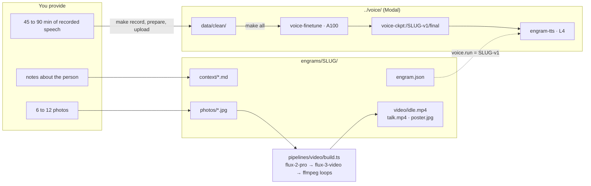

# Adding an engram

An engram is one folder under `engrams/`. To add a person, you create the folder, write a manifest and a few context cards, drop in photos, then build a face and a voice. The server reads the folder on every request, so the new person appears in the drawer as soon as you reload the stage.

This guide uses `SLUG` for the folder name (lowercase, no spaces, for example `prannay`) and `NAME` for the person's display name.



**Figure 1.** What you provide, where it lands, and which pipeline turns it into a face and a voice.

## The folder contract

Create these paths:

```
engrams/SLUG/
  engram.json        manifest (EngramManifest in shared/types.ts)
  context/*.md       one card per file, YAML frontmatter + markdown body
  photos/*.jpg       reference photos, input to the video pipeline
  video/             idle.mp4, talk.mp4, poster.jpg, written by the video pipeline
```

### engram.json

The manifest tells the server which model answers, which voice speaks, and where the clips are:

```json
{
  "slug": "SLUG",
  "name": "NAME",
  "tagline": "One line shown under the name in the drawer.",
  "pronouns": "she/her",
  "voice": {
    "provider": "modal",
    "run": "SLUG-v1",
    "systemPrompt": "Perform TTS. Use NAME's voice."
  },
  "video": {
    "idle": "video/idle.mp4",
    "talk": "video/talk.mp4",
    "poster": "video/poster.jpg"
  },
  "brain": {
    "model": "hf.co/LiquidAI/LFM2.5-1.2B-Instruct-GGUF:Q4_K_M",
    "persona": "You are NAME, speaking out loud to someone standing in front of you. Answer in first person, in one to three short spoken sentences. Stick to what your notes say; if you don't know something, say so plainly."
  }
}
```

- `voice.run` must match the `RUN` you train in `../voice`. Until that run exists on Modal, the TTS service falls back to the base voice and logs a `tts_fallback` event. Set `run` to `base` to use the stock voice on purpose.
- `voice.systemPrompt` must match the system prompt the voice was trained with (see [Voice](#voice)).
- `brain.persona` is prepended to the context cards on every turn. Keep it to one paragraph about who is speaking and how.
- `pronouns` is optional.

### context/*.md

Each file is one card in the context bank and one candidate fact block for the brain. The frontmatter needs four fields:

```markdown
---
section: story
title: "The Uhaul"
source: ~/Agent/prannay.md
updatedAt: 2026-09-25T00:00:00Z
---
Drove a Uhaul from Dallas to San Francisco in 2024 with everything he owned.

- Worked East Coast hours from a hostel, 5 am to 4 pm.
- Went to a tech event every night.
```

| Field | Values |
|---|---|
| `section` | `profile`, `story`, `work`, `opinions`, `voice`, `memory`, or `live`. The bank shows them in that order as Profile, Story, Work, Opinions, How he talks, Memories, and Live from the web. |
| `title` | Card heading. |
| `source` | Where the fact came from: a path, a URL, or `conversation 2026-09-25`. Shown in monospace under the card. |
| `updatedAt` | ISO timestamp. Falls back to the file's modification time if missing. |

The body is markdown-lite: paragraphs and bullet lists. Cards are matched to a question by keyword overlap, so write concrete nouns, names, and dates rather than summaries.

Name files `SECTION-NN-topic.md` so they sort in a sensible order within a section, for example `opinions-03-off-policy-rl.md`. Two sections are written by the server, not by you:

- `memory-*.md`: after each conversation, `POST /chat` saves what was said as a Memories card.
- `live-*.md`: the **Ask the web** field and the brain's own Nimble searches save results as Live from the web cards.

Two `voice-*` cards matter more than the rest: one that lists the person's vocabulary and one that describes how they talk, with a few example sentences. They shape the brain's tone without any model change.

### photos/

Copy 6 to 12 clear photos of the face, JPEG, longest side around 1500 px, EXIF rotation applied. Number them in order of preference, because the portrait step sends the first four in filename order as identity references. Frontal, evenly lit, closed-mouth shots first; angle and expression variety after.

Write a `photos/README.md` that says where each photo came from and why you picked it, as `engrams/prannay/photos/README.md` does. Anyone reviewing the face later needs that.

Photos with another person in frame must not be sent as references. In `pipelines/video/build.ts`, `refs()` skips files whose names start with `08` for that reason; rename or move any such photo so it sorts after the ones you want used.

## Check the folder

Reload the stage and press `[`. The new row shows three marks:

- **voice** is green as soon as the manifest exists.
- **face** turns green when `video/idle.mp4` exists.
- **context** turns green when `context/` has at least one card.

Or check from the terminal:

```bash
curl -s localhost:4100/api/engrams | jq '.[] | select(.slug == "SLUG")'
```

Open `http://localhost:4173/e/SLUG`. Until the face is built, the stage shows the poster with one line telling you to run the video build.

## Face

The video pipeline lives in `pipelines/video/`. It asks Black Forest Labs for a studio portrait from your reference photos, then for a 6 second idle clip and a 6 second talking clip from that portrait, then loops both with ffmpeg so frame 0 equals the poster.

Before you run it, edit two things in `pipelines/video/build.ts`:

- `IDENTITY` describes the person to the image model. It is written for Prannay (skin tone, hair, jawline). Rewrite it for the new person.
- `PORTRAIT_PROMPT` mentions a "young man". Adjust as needed.

Then build in two steps so you can pick the best portrait. First, generate portrait candidates:

```bash
source ~/.local/secrets
npm run video:build -- SLUG --step portrait --candidates 3
```

The candidates land in `review/video/portrait-1.jpg` through `portrait-3.jpg`. Look at them, then build the clips from the one you like:

```bash
npm run video:build -- SLUG --step clips --portrait review/video/portrait-2.jpg
```

This writes `engrams/SLUG/video/idle.mp4`, `talk.mp4`, and `poster.jpg`, copies everything to `review/video/`, and prints a `verify.json` report with both clips' dimensions and the first-to-last frame PSNR, which tells you how seamless the loop is.

| Flag | Default | Meaning |
|---|---|---|
| `--step` | `all` | `portrait`, `clips`, `idle`, `talk`, or `all` |
| `--candidates N`, `--from N` | `3`, `1` | How many portraits to render and the first seed index |
| `--portrait PATH` | `review/video/portrait-chosen.jpg` | Portrait to animate |
| `--seconds N` | `6` | Clip length sent to `flux-3-video` |
| `--resolution hd\|fhd` | `fhd` | 1280x720 or 1920x1080 |
| `--loop pingpong\|xfade` | `pingpong` | How ffmpeg closes the loop |
| `--no-loops` | | Stop after the raw clips |

Costs at the time of writing: about $0.10 per portrait and $1.74 per 6 second `fhd` clip. Every call is appended to `pipelines/video/runs.jsonl` with its prompt, parameters, task id, and cost. The [video pipeline](video-pipeline.md) page explains each stage in detail.

`review/video/` is shared across engrams, so a second engram's portraits overwrite the first one's candidates. Move the ones you want to keep before you build another face.

## Voice

The voice is `LFM2.5-Audio-1.5B` fully fine-tuned on the person's recordings. Recording happens on the Mac, training on a Modal A100, and serving on a Modal L4. Everything is driven from `../voice/Makefile`; run `make` with no target to list the targets.

The model has no zero-shot cloning. The voice is bound to the system prompt it was trained with, which is why `voice.systemPrompt` in `engram.json` must match the `--system-prompt` you train with. The [voice pipeline](voice-pipeline.md) page follows the audio from the microphone to the stage.

### Record

1. List microphones and note the index of the one you will use for every session:

   ```bash
   cd ../voice
   make devices
   ```

2. Record the guided sentences. The prompts come from `prompts/sentences.txt` (about 70 minutes of reading). The session is resumable:

   ```bash
   make record DEVICE=2
   ```

   Press Enter to record, Enter to stop, Enter to keep, `r` to redo, `p` to play back.

3. Optional: record a few free-talk takes of 5 to 10 minutes, then split and transcribe them locally with Whisper:

   ```bash
   make record-free DEVICE=2
   make transcribe
   ```

4. Clean, normalize to 24 kHz, and split into train and validation. The report at the end says whether you have enough:

   ```bash
   make prepare
   ```

   Aim for 45 to 90 minutes of kept audio (400 to 800 clips of 2 to 14 seconds). Twenty minutes gives a rough first result.

Quiet room, same microphone and distance every time, no music, read exactly what is shown.

### Train

Upload the clean set and run preprocess, train, and a synth pass in one detached Modal run. `DATASET` names the folder on the `voice-data` volume and `RUN` names the checkpoint on `voice-ckpt`:

```bash
make upload DATASET=SLUG
uv run modal run --detach modal_app.py --stage all --dataset SLUG --run SLUG-v1 --epochs 8 \
  --system-prompt "Perform TTS. Use NAME's voice."
```

`make all DATASET=SLUG RUN=SLUG-v1` runs the same thing with the default system prompt, which names Prannay, so pass `--system-prompt` directly for anyone else. Training one hour of audio for 8 epochs takes about 40 to 60 minutes on an A100-80GB and costs roughly $2 to $3. Logs are in the Modal dashboard under app `voice-finetune`.

When it finishes, listen to the samples and generate more:

```bash
make synth RUN=SLUG-v1 TEXT="Hey, this is NAME. Does this sound like me?"
```

Samples land in `samples/SLUG-v1/`. Compare against the stock voice with `uv run modal run modal_app.py --stage synth --run base`.

Optional: pull the checkpoint to `checkpoints/SLUG-v1/` so the Inspect page reads the real `training_args.json` instead of fixtures:

```bash
make download RUN=SLUG-v1
```

### Serve

The TTS service `engram-tts` (`serve.py`) loads `/ckpt/RUN/final` from the `voice-ckpt` volume when it exists and the base model otherwise, and reports which one in the `x-voice-provider` header. Deploy it once; it serves every run:

```bash
make deploy
```

This writes `../voice/.tts-url`. The API reads that file (or `ENGRAM_TTS_URL`) on each request. Verify from the engram side:

```bash
curl -s localhost:4100/api/engrams/SLUG/tts/health
```

`run_exists: true` means the fine-tuned voice is live. The service keeps one L4 warm at about $0.80 per hour; stop it with `make tts-stop` when you are not demoing.

## How it shows up

Reload the stage. The drawer row for `SLUG` now has three green marks, `/e/SLUG` plays the idle loop, and the first question is answered in the new voice. The Inspect page at `/inspect/SLUG` fills its turn list from RawTree as soon as the first conversation is logged. Its run header and training curves stay empty until `make download` puts a `checkpoints/SLUG-v1/training_args.json` under `../voice`; the fixtures you see for `prannay` are only wired up for that slug.

If something is off:

| Symptom | Check |
|---|---|
| Row missing from the drawer | `engrams/SLUG/engram.json` exists and parses. `curl localhost:4100/api/engrams`. |
| "Face not generated yet" on the stage | `engrams/SLUG/video/idle.mp4` exists. `curl -I localhost:4100/api/engrams/SLUG/video/idle`. |
| Answers in the base voice | `curl localhost:4100/api/engrams/SLUG/tts/health` shows `run_exists: false`: the run name in `engram.json` does not match a finished checkpoint on `voice-ckpt`. |
| Answers know nothing about the person | `context/` cards have a `section` in the frontmatter and concrete nouns in the body. `curl localhost:4100/api/engrams/SLUG/context`. |
| `no TTS url` in the API log | Run `make deploy` in `../voice`, or set `ENGRAM_TTS_URL`. |
