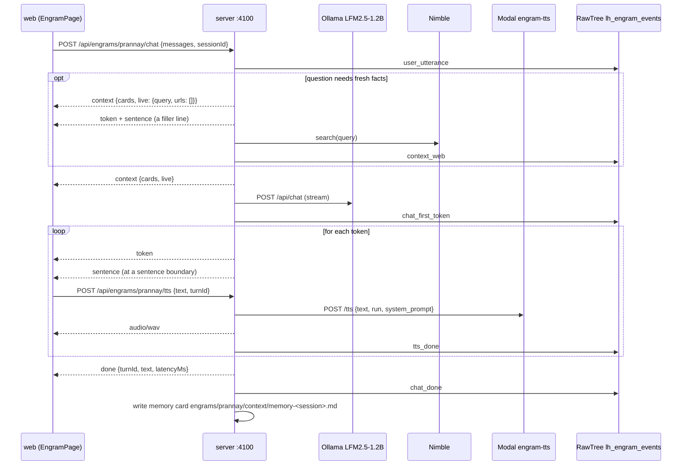

# API reference

The Engram server is a Hono app on `http://localhost:4100`. Every route is under `/api`. In development Vite on `:4173` proxies `/api` to it, so the web app and these examples hit the same server.

Responses are JSON unless a route says otherwise. Errors are `{ "error": string }` with a real status code. CORS is open on `/api/*`. Wire types come from `shared/types.ts` and are named in each section.

Routes are mounted in `server/index.ts`, one file per area under `server/routes/`. Files under `review/` are also served at `/review/*` for the review pages.

## One conversational turn



**Figure 1.** How the routes on this page work together during one turn. The web app starts TTS on each `sentence` event while the model is still writing.

## Engrams

Source: `server/routes/engrams.ts`. One folder under `engrams/<slug>/` with an `engram.json` is one engram.

### GET /api/engrams

Lists every engram with readiness marks. Returns `EngramSummary[]`.

Example:

```bash
curl -s http://localhost:4100/api/engrams
```

Response:

```json
[{"slug":"prannay","name":"Prannay Hebbar","tagline":"AI researcher. Post-training, coding agents, program synthesis.","cards":37,"ready":{"voice":true,"video":true,"context":true}}]
```

`ready.video` is true when the idle clip exists on disk, `ready.context` when at least one card exists. `ready.voice` is always true.

### GET /api/engrams/:slug

Returns the manifest with a card count: `EngramManifest & { cards: number }`. Unknown slugs return `404 {"error":"no engram at .../engrams/<slug>/engram.json"}`.

Example:

```bash
curl -s http://localhost:4100/api/engrams/prannay
```

Response:

```json
{"slug":"prannay","name":"Prannay Hebbar","tagline":"AI researcher. Post-training, coding agents, program synthesis.","pronouns":"he/him","voice":{"provider":"modal","run":"prannay-v1","systemPrompt":"Perform TTS. Use Prannay's voice."},"video":{"idle":"video/idle.mp4","talk":"video/talk.mp4","poster":"video/poster.jpg"},"brain":{"model":"hf.co/LiquidAI/LFM2.5-1.2B-Instruct-GGUF:Q4_K_M","persona":"You are Prannay Hebbar, speaking out loud ..."},"cards":37}
```

### GET /api/engrams/:slug/video/:clip

Streams a video asset. `clip` is `idle`, `talk`, or `poster`. Returns `video/mp4` or `image/jpeg` with `Accept-Ranges: bytes`, and honors a `Range` header with `206 Partial Content`, which `<video>` elements need for seeking.

Example:

```bash
curl -s -o /dev/null -w "%{http_code} %{content_type} %{size_download}\n" \
  -H "Range: bytes=0-1023" http://localhost:4100/api/engrams/prannay/video/idle
```

Response:

```text
206 video/mp4 1024
```

Errors: `404 {"error":"unknown clip <clip>"}` for a name that is not in the manifest, and `404 {"error":"clip not generated yet: video/idle.mp4"}` until [the video pipeline](video-pipeline.md) has run.

## Context bank

Source: `server/routes/context.ts`. Cards are Markdown files in `engrams/<slug>/context/*.md` with frontmatter `section`, `title`, `source`, `updatedAt`. The file name without `.md` is the card `id`.

### GET /api/engrams/:slug/context

Returns `ContextCard[]` sorted by section (`profile`, `story`, `work`, `opinions`, `voice`, `memory`, `live`) and then by id.

Example:

```bash
curl -s http://localhost:4100/api/engrams/prannay/context | head -c 400
```

Response:

```json
[{"id":"profile-01-who","section":"profile","title":"Who he is","body":"Prannay Hebbar is an AI researcher and post-training engineer based in Palo Alto, California. ...","source":"~/Agent/prannay.md","updatedAt":"2026-09-25T00:00:00.000Z"}, ...]
```

### POST /api/engrams/:slug/context/web

Runs a Nimble search and saves each hit as a `section: live` card. Body `{ query: string }`. Returns the new `ContextCard[]`; the first card also carries Nimble's synthesized answer above its snippet. Logs a `context_web` event.

Example:

```bash
curl -s -X POST http://localhost:4100/api/engrams/prannay/context/web \
  -H 'Content-Type: application/json' \
  -d '{"query":"Long Horizon Agents Hackathon September 2026"}'
```

Response:

```json
[{"id":"live-20260925202642-0-sf-and-bay-area-ai-events","section":"live","title":"SF and Bay Area AI Events","body":"Long Horizon Agents Hackathon is scheduled for September 25, 2026, from 9:30 am to 7:30 pm PT at the AWS Builder Loft in San Francisco ...","source":"https://agendahero.com/schedule/0f8899a0-3dbc-4d6a-ad05-58225b751316","updatedAt":"2026-09-25T20:26:42.932Z"}, ...]
```

Errors: `400 query is required`, `502 web search failed: <reason>` when Nimble fails, `404 the web had nothing on that` when the search returns no hits.

### POST /api/engrams/:slug/context

Writes one card by hand. Body `{ section, title, body, source?, id? }`. Returns the `ContextCard` with status `201`. Without `id` the file is named `<section>-<timestamp>-<slug of title>`. The brain uses this shape internally to save `memory` cards after a conversation.

Example:

```bash
curl -s -X POST http://localhost:4100/api/engrams/prannay/context \
  -H 'Content-Type: application/json' \
  -d '{"section":"memory","title":"Docs check","body":"Wrote the API reference.","source":"docs-check"}'
```

Response:

```json
{"id":"memory-20260925202642-docs-check","section":"memory","title":"Docs check","body":"Wrote the API reference.","source":"docs-check","updatedAt":"2026-09-25T20:26:42.993Z"}
```

Errors: `400 section must be one of profile, story, work, opinions, voice, memory, live`, `400 title and body are required`. Delete a card by removing its file.

## Chat

Source: `server/routes/chat.ts`, with `server/lib/prompt.ts` (card selection and prompt) and `server/lib/liquid.ts` (Ollama client).

### POST /api/engrams/:slug/chat

Streams an answer as Server-Sent Events. Body `{ messages: ChatMessage[], sessionId?: string }`; the last message must have `role: "user"`. The response is `text/event-stream` with one `data: <ChatEvent JSON>` line per event. Use `-N` so curl does not buffer.

Example:

```bash
curl -sN -X POST http://localhost:4100/api/engrams/prannay/chat \
  -H 'Content-Type: application/json' \
  -d '{"messages":[{"role":"user","content":"What are you working on right now?"}],"sessionId":"docs-check"}'
```

Response:

```text
data: {"type":"context","cards":["work-05-founder-search","memory-5tkql9cd","voice-01-vocabulary","voice-02-how-he-talks"]}

data: {"type":"token","text":"I"}

data: {"type":"token","text":"'m"}

data: {"type":"token","text":" P"}

# ... more tokens ...

data: {"type":"sentence","index":0,"text":"I'm Prannay Hebbar, and I'm actually founding a company."}

# ... more tokens ...

data: {"type":"sentence","index":1,"text":"Right now I'm focusing on building the product, raising seed money in SF, and trying to get it to market."}

data: {"type":"done","turnId":"d7f6f735-e346-4c10-b967-a05358bd0110","text":"I'm Prannay Hebbar, and I'm actually founding a company. Right now I'm focusing on building the product, raising seed money in SF, and trying to get it to market.","latencyMs":1880}
```

Errors before the stream opens: `400 messages must end with a user message`, `404 no engram at ...`. Errors during the stream arrive as an `error` event followed by `done`.

#### SSE event order

Events are `ChatEvent` from `shared/types.ts`. The order within one response is:

1. `context` (only when the question needs the web): `{ cards, live: { query, urls: [] } }`. Then one `token` and one `sentence` carrying a filler line such as "Hang on, let me check." so the engram speaks while Nimble runs (6 s timeout).
2. `context`: `{ cards: string[], live?: { query, urls } }`. The card ids the prompt used, in order, and the web hits if any. The web app highlights these cards for 4 s.
3. `token`: `{ text }`, one per model token, Markdown characters stripped.
4. `sentence`: `{ index, text }`, emitted as soon as a sentence boundary (`.`, `!`, `?`) is seen and the sentence is at least 12 characters. Send each one to `/tts` right away. At most 3 sentences per turn; the stream stops the model after the third.
5. `error`: `{ message }`, only if Ollama fails mid-stream.
6. `done`: `{ turnId, text, latencyMs }`. `text` is the spoken sentences joined with spaces. Always the last event.

A question needs the web when it matches `WEB_TRIGGERS` (today, latest, news, hackathon, weather, price, a year 2026 to 2029, and similar) or asks "who is" or "what is" about something no card mentions.

After `done`, the server writes a `memory` card `memory-<sessionId>` summarizing the session's exchanges, and logs `user_utterance`, `chat_first_token`, and `chat_done` events. The model is `brain.model` from the manifest, served by Ollama at `OLLAMA_URL` (default `http://localhost:11434`) with `num_predict: 80` and `temperature: 0.3`.

## Voice

Source: `server/routes/tts.ts`. Provider details are in [the voice pipeline](voice-pipeline.md).

### POST /api/engrams/:slug/tts

Synthesizes one sentence. Body `{ text: string, turnId?: string }`. Returns `audio/wav`, 24 kHz mono PCM16, with these headers:

| Header | Value |
|---|---|
| `x-voice-provider` | `modal:<run>`, `modal:base`, or `local:say` |
| `x-voice-cache` | `hit` or `miss` |
| `x-voice-ms` | synthesis time on a miss |

Example:

```bash
curl -s -D - -o /tmp/hello.wav -X POST http://localhost:4100/api/engrams/prannay/tts \
  -H 'Content-Type: application/json' \
  -d '{"text":"Hey, this is Prannay. Thanks for coming by."}' | grep -iE '^(HTTP|content-type|x-voice)'
```

Response:

```text
HTTP/1.1 200 OK
content-type: audio/wav
x-voice-cache: miss
x-voice-ms: 4295
x-voice-provider: modal:base
```

Errors: `400 text is required`, `404 no engram <slug>`, `503 no TTS provider available: Modal unreachable and local say disabled`. Every fallback logs a `tts_fallback` event; every success logs `tts_done`.

### GET /api/engrams/:slug/tts/health

Reports which voice `/tts` will use. Merges the Modal service's `/health` with `ok`, `run`, and `local` (whether the macOS fallback is available and enabled). Returns `503` with `detail` when Modal is unreachable.

Example:

```bash
curl -s http://localhost:4100/api/engrams/prannay/tts/health
```

Response:

```json
{"ok":true,"run":"prannay-v1","url":"https://shared-13706--engram-tts.modal.run","loaded":["base"],"provider":"modal:base","run_exists":false,"load_seconds":{"base":27},"started":"2026-09-25T20:03:19Z","base_model":"LiquidAI/LFM2.5-Audio-1.5B","local":true}
```

## Events

Source: `server/routes/events.ts` and `server/lib/rawtree.ts`. Rows go to the Tinybird RawTree table `lh_engram_events` in database `default`. Inserts are buffered (flush every 2 s or 20 rows) and never block the caller. `meta` is stored as a JSON string and parsed back on read.

### POST /api/events

Body is `Omit<EventRow, 'ts'>`; the server stamps `ts`. `engram`, `session`, and `type` are required. Returns `{ ok: true }`.

Example:

```bash
curl -s -X POST http://localhost:4100/api/events \
  -H 'Content-Type: application/json' \
  -d '{"engram":"prannay","session":"docs-check","type":"session_start"}'
```

Response:

```json
{"ok":true}
```

Errors: `400 engram, session and type are required`, `400 unknown type <type>`.

Event types and who emits them:

| `type` | Emitted by | Useful fields |
|---|---|---|
| `session_start` | web, when the visitor presses start | |
| `user_utterance` | chat route | `text`, `chars` |
| `chat_first_token` | chat route | `ms` since the request, `provider` (model tag), `meta.web` |
| `chat_done` | chat route | `ms`, `chars`, `text`, `meta.cards`, `meta.firstTokenMs`, `meta.sentences`, `meta.web` |
| `tts_done` | tts route | `ms`, `provider`, `chars`, `meta.modalMs` |
| `tts_fallback` | tts route | `provider` fallen back to, `text` (reason) |
| `video_state` | web, on idle/talk crossfade | |
| `context_web` | chat and context routes | `text` (query), `chars` (hit count), `meta.urls` |
| `inspect_flag` | inspect route | `text` (note), `meta.track`, `meta.tag`, `meta.start`, `meta.end`, `meta.flagId` |

### GET /api/events?engram=&since=&limit=

Queries RawTree. `engram` filters by slug, `since` is an ISO timestamp lower bound, `limit` defaults to 200 and is capped at 2000. Returns `EventRow[]` newest first. Note that RawTree returns `ts` as `YYYY-MM-DD HH:MM:SS.nnnnnnnnn` without a zone; treat it as UTC.

Example:

```bash
curl -s "http://localhost:4100/api/events?engram=prannay&limit=2"
```

Response:

```json
[{"chars":162,"engram":"prannay","meta":{"cards":["work-05-founder-search","memory-5tkql9cd","voice-01-vocabulary","voice-02-how-he-talks"],"firstTokenMs":1441,"sentences":2,"web":null},"ms":1880,"provider":"hf.co/LiquidAI/LFM2.5-1.2B-Instruct-GGUF:Q4_K_M","session":"docs-check","text":"I'm Prannay Hebbar, and I'm actually founding a company. ...","ts":"2026-09-25 20:24:19.294000000","turn":"d7f6f735-e346-4c10-b967-a05358bd0110","type":"chat_done"}, ...]
```

Errors: `502 RawTree query failed: <reason>`.

## Inspect

Source: `server/routes/inspect.ts`. Backs the Inspect page at `/inspect/:slug`. Flags and distill jobs are appended to `review/flags.jsonl` and `review/distill-jobs.jsonl`. Where a real source is missing, responses say so in `source`.

### GET /api/inspect/:slug/runs

Returns `InspectRun[]`. Reads `../voice/checkpoints/<run>/training_args.json` (the `make download` output) for runs whose name starts with the slug and fills curves from fixtures scaled to the real step count, with `source: "checkpoints"`. Without any checkpoint folder it returns the `prannay-v1` fixture with `source: "fixture"`.

Example:

```bash
curl -s http://localhost:4100/api/inspect/prannay/runs
```

Response:

```json
[{"id":"prannay-v1","baseModel":"LiquidAI/LFM2.5-Audio-1.5B","gpu":"A100-80GB","epochs":8,"steps":2400,"batchSize":16,"lr":0.00005,"warmup":240,"nTrain":4800,"nVal":240,"startedAt":"2026-09-24T21:12:40Z","finishedAt":"2026-09-25T00:41:07Z","trainMinutes":208.4,"engram":"prannay","status":"done","currentStep":2400,"checkpoints":[{"step":400,"epoch":1,"trainLoss":2.9414,"valLoss":2.9319,"speakerSim":0.5919,"wer":11.76,"savedAt":"2026-09-24T21:47:24.000Z"}, ...],"curve":[...],"source":"fixture"}]
```

### GET /api/inspect/:slug/turns

Returns the last 50 `InspectTurn[]`, newest first. Turns are rebuilt from RawTree events grouped by `turn` (needs a `chat_done` with text), with word timings laid out from the text length, and `source: "rawtree"`. If RawTree has no turns for the slug, `prannay` gets 14 fixture turns. When a wav in `review/voice/` matches the turn text (via a `.txt` sidecar, the `sha1(run+text)` name, or `<slug>-<turnId>.wav`), the turn carries a `wav` URL.

Example:

```bash
curl -s http://localhost:4100/api/inspect/prannay/turns | head -c 300
```

Response:

```json
[{"id":"d7f6f735-e346-4c10-b967-a05358bd0110","ts":"2026-09-25T20:24:17.417Z","user":"What are you working on right now?","text":"I'm Prannay Hebbar, and I'm actually founding a company. ...","durationMs":9776,"latencyMs":1441,"provider":"no tts","words":[{"text":"I'm","start":0.12,"end":0.336}, ...],"source":"rawtree"}, ...]
```

### GET /api/inspect/:slug/flags

Returns `InspectFlag[]` for the slug from `review/flags.jsonl`.

Example:

```bash
curl -s http://localhost:4100/api/inspect/prannay/flags
```

Response:

```json
[{"id":"f-muhdn7ja-160f","engram":"prannay","turnId":"t-140819-1bfe","track":"voice","start":0.9,"end":1.8,"tag":"pacing","note":"rushes through 'come find the real me'","ts":"2026-09-25T19:52:03.046Z"}, ...]
```

### POST /api/inspect/:slug/flags

Marks a region of a turn. Body `{ turnId, track: "voice" | "face", start, end, tag, note? }` in seconds with `end > start`. Voice tags: `pronunciation`, `pacing`, `timbre`, `artifact`. Face tags: `lip-sync`, `glitch`, `lighting`, `gaze`. Returns the `InspectFlag` with status `201` and logs an `inspect_flag` event.

Example:

```bash
curl -s -X POST http://localhost:4100/api/inspect/prannay/flags \
  -H 'Content-Type: application/json' \
  -d '{"turnId":"d7f6f735-e346-4c10-b967-a05358bd0110","track":"voice","start":0.8,"end":1.4,"tag":"pacing","note":"rushes the name"}'
```

Response:

```json
{"id":"f-muhevsj7-5327","engram":"prannay","turnId":"d7f6f735-e346-4c10-b967-a05358bd0110","track":"voice","start":0.8,"end":1.4,"tag":"pacing","note":"rushes the name","ts":"2026-09-25T20:26:43.123Z"}
```

Errors: `400 turnId required`, `400 track must be 'voice' or 'face'`, `400 tag must be one of pronunciation, pacing, timbre, artifact` (or the face list), `400 start/end must be seconds with end > start`.

### POST /api/inspect/:slug/distill

Queues a distill job from selected flags. Body `{ flagIds: string[], fromCheckpoint?: number }` (default checkpoint 2000). Returns a `DistillJob` with status `202`. The job is a realistic stand-in: it advances through `queued`, `preparing`, `training`, `evaluating`, and `done` over 270 s of wall time on every read, and does not train anything.

Example:

```bash
curl -s -X POST http://localhost:4100/api/inspect/prannay/distill \
  -H 'Content-Type: application/json' \
  -d '{"flagIds":["f-muhdn7ja-160f"],"fromCheckpoint":1600}'
```

Response:

```json
{"id":"d-muhevsjp","engram":"prannay","flagIds":["f-muhdn7ja-160f"],"fromCheckpoint":1600,"createdAt":"2026-09-25T20:26:43.141Z","status":"queued","progress":0,"eta":"2026-09-25T20:31:13.141Z","detail":"waiting for an A100"}
```

Errors: `400 flagIds required: select at least one flag`.

### GET /api/inspect/:slug/jobs

Returns `DistillJob[]` for the slug, newest first, with `status`, `progress`, `eta`, and `detail` advanced to the current time.

Example:

```bash
curl -s http://localhost:4100/api/inspect/prannay/jobs
```

Response:

```json
[{"id":"d-muhe0i1s","engram":"prannay","flagIds":["f-muhdzrov-deff","f-muhdzskx-e335"],"fromCheckpoint":1600,"createdAt":"2026-09-25T20:02:23.200Z","status":"done","progress":1,"eta":"2026-09-25T20:06:53.200Z","detail":"merged into prannay-v1.1 from step 1600"}, ...]
```

### GET /api/inspect/:slug/wav/:name

Serves a sample from `review/voice/<name>` as `audio/wav`. The name is reduced to `[a-z0-9._-]`. Unknown names return `404 no such sample`.

Example:

```bash
curl -s -o /dev/null -w "%{http_code} %{content_type} %{size_download}\n" \
  http://localhost:4100/api/inspect/prannay/wav/00-modal-base-warm.wav
```

Response:

```text
200 audio/wav 268844
```

## Health

Source: `server/routes/health.ts`.

### GET /api/health

Checks all five dependencies in parallel and returns `Health`. Ollama: the manifest model is in `/api/tags`. TTS: calls `/api/engrams/prannay/tts/health`. Nimble: the status of the last call. RawTree: `SELECT 1`. BFL: `GET https://api.bfl.ai/v1/credits`.

Example:

```bash
curl -s http://localhost:4100/api/health
```

Response:

```json
{"ollama":{"ok":true,"model":"hf.co/LiquidAI/LFM2.5-1.2B-Instruct-GGUF:Q4_K_M","detail":"1 model(s) loaded"},"tts":{"ok":true,"provider":"modal:base","detail":"LiquidAI/LFM2.5-Audio-1.5B · run prannay-v1 · loaded: base"},"nimble":{"ok":true,"detail":"key present, no call yet"},"rawtree":{"ok":true,"detail":"SELECT 1 in 1 ms; key present, no flush yet"},"bfl":{"ok":true,"detail":"9402 credits"}}
```

Each entry has `ok` and a human `detail` that says what to do when something is off, for example `pull it: ollama pull <model>` or `MODAL_TOKEN_ID missing`.

## Environment variables

| Variable | Default | Used by |
|---|---|---|
| `PORT` | `4100` | server |
| `ENGRAMS_DIR` | `engrams` | engram store |
| `OLLAMA_URL`, `LIQUID_MODEL` | `http://localhost:11434`, `hf.co/LiquidAI/LFM2.5-1.2B-Instruct-GGUF:Q4_K_M` | chat |
| `NIMBLE_API_KEY` | | context/web, chat live lookups |
| `RAWTREE_API_KEY`, `RAWTREE_DATABASE` | , `default` | events |
| `BFL_API_KEY` | | health, video pipeline |
| `ENGRAM_TTS_URL` | contents of `../voice/.tts-url` | tts |
| `ENGRAM_TTS_LOCAL` | on; set `0` to disable the macOS `say` fallback | tts |
| `TTS_CACHE_DIR` | `review/tts-cache` | tts |
| `VOICE_DIR` | `../voice` | inspect runs |

Load keys with `source ~/.local/secrets` before `npm run dev`.
