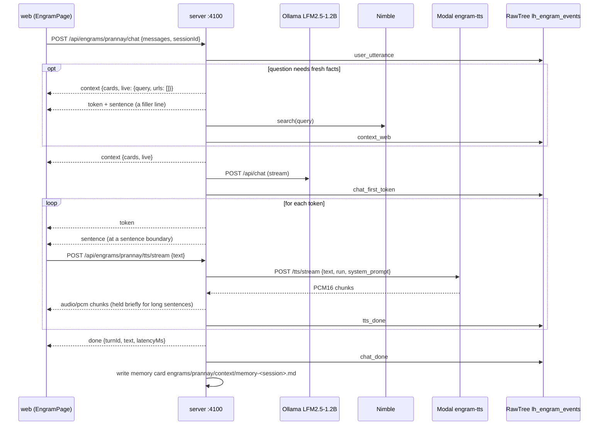

# API reference

The Engram server is a Hono app on `http://localhost:4100`. Every route is under `/api`. In development Vite on `:4173` proxies `/api` to it, so the web app and these examples hit the same server.

Responses are JSON unless a route says otherwise. Errors are `{ "error": string }` with a real status code; every route that takes a `:slug` answers `404 {"error":"no engram <slug>"}` for a folder that does not exist. CORS is open on `/api/*`. Wire types come from `shared/types.ts` and are named in each section.

Routes are mounted in `server/index.ts`, one file per area under `server/routes/`. Files under `review/` are also served at `/review/*` for the review pages.

## One conversational turn



**Figure 1.** How the routes on this page work together during one turn. The web app opens a `/tts/stream` request on each `sentence` event while the model is still writing, and falls back to `/tts` only if the stream answers `503`.

## Engrams

Source: `server/routes/engrams.ts`. One folder under `engrams/<slug>/` with an `engram.json` is one engram.

### GET /api/engrams

Lists every engram with readiness marks. Returns `EngramSummary[]`.

Example:

```bash
curl -s http://localhost:4100/api/engrams
```

Response:

```json
[{"slug":"prannay","name":"Prannay Hebbar","tagline":"AI researcher. Post-training, coding agents, program synthesis.","cards":38,"ready":{"voice":true,"video":true,"context":true}}]
```

`ready.video` is true when the idle clip exists on disk, `ready.context` when at least one card exists. `ready.voice` is always true.

### GET /api/engrams/:slug

Returns the manifest with a card count: `EngramManifest & { cards: number }`. Unknown slugs return `404 {"error":"no engram <slug>"}`.

Example:

```bash
curl -s http://localhost:4100/api/engrams/prannay
```

Response, with the persona shortened to its first two sentences:

```json
{"slug":"prannay","name":"Prannay Hebbar","tagline":"AI researcher. Post-training, coding agents, program synthesis.","pronouns":"he/him","voice":{"provider":"modal","run":"prannay-v1","systemPrompt":"Perform TTS. Use Prannay's voice."},"video":{"idle":"video/idle.mp4","talk":"video/talk.mp4","poster":"video/poster.jpg"},"brain":{"model":"hf.co/LiquidAI/LFM2.5-1.2B-Instruct-GGUF:Q4_K_M","persona":"You are Prannay Hebbar, speaking out loud to someone standing in front of you. Answer in first person, in one to three short spoken sentences."},"cards":38}
```

### GET /api/engrams/:slug/video/:clip

Streams a video asset. `clip` is `idle`, `talk`, or `poster`. Returns `video/mp4` or `image/jpeg` with `Accept-Ranges: bytes`, and honors a `Range` header with `206 Partial Content`, which `<video>` elements need for seeking.

Example:

```bash
curl -s -o /dev/null -w "%{http_code} %{content_type} %{size_download}\n" \
  -H "Range: bytes=0-1023" http://localhost:4100/api/engrams/prannay/video/idle
```

Response:

```text
206 video/mp4 1024
```

Errors: `404 {"error":"unknown clip <clip>"}` for a name that is not in the manifest, and `404 {"error":"clip not generated yet: video/idle.mp4"}` until [the video pipeline](video-pipeline.md) has run.

## Context bank

Source: `server/routes/context.ts` and `server/lib/cards.ts`. Cards are Markdown files in `engrams/<slug>/context/*.md` with frontmatter `section`, `title`, `source`, `updatedAt`. The file name without `.md` is the card `id`.

### GET /api/engrams/:slug/context

Returns `ContextCard[]` sorted by section (`profile`, `story`, `work`, `opinions`, `voice`, `memory`, `live`) and then by id. The context bank panel shows the same cards with Live from the web first.

Example:

```bash
curl -s http://localhost:4100/api/engrams/prannay/context | head -c 400
```

Response, cut at 400 bytes:

```json
[{"id":"profile-01-who","section":"profile","title":"Who he is","body":"Prannay Hebbar is an AI researcher and post-training engineer based in Palo Alto, California. Born September 2001, Indian-American, grew up in India and moved to the US at 22. He works on post-training for coding and computer-use agents, RL for agents, and program synthesis, which he calls his decade-long bet.\n\nSince July 20
```

### POST /api/engrams/:slug/context/web

Runs a Nimble search and saves the result as `section: live` cards. Body `{ query: string }`. The optional `x-session-id` header names the session in the logged `context_web` event. Returns the `ContextCard[]` it wrote:

- First, when Nimble returns a synthesized answer that names the person: one card with id `live-answer-<slug of query>`, the query as its title, and `source` set to `web: <host>, <host>` listing the hosts of the hits.
- Then one card per hit whose snippet names the person and whose host is not a people-search or PDF site (`rocketreach`, `zoominfo`, `scribd`, and similar are dropped). A hit whose URL already has a live card reuses that card's id, so repeated queries do not pile up duplicates.

Example:

```bash
curl -s -X POST http://localhost:4100/api/engrams/prannay/context/web \
  -H 'Content-Type: application/json' \
  -d '{"query":"Prannay Hebbar"}'
```

Response, as written to `engrams/prannay/context/` by that query:

```json
[{"id":"live-answer-prannay-hebbar","section":"live","title":"Prannay Hebbar","body":"Prannay Hebbar is an AI researcher/engineer based in San Francisco, with work spanning post-training, RL for agents, and program synthesis; his site highlights NeurIPS 2025 work and projects like RL agents in Minecraft and CUDA kernel optimization, and lists affiliations with Stanford and AGI Inc.","source":"web: prannayh.com, github.com, rocketreach.co","updatedAt":"2026-09-25T21:46:39.209Z"},{"id":"live-20260925214639-0-prannay-hebbar","section":"live","title":"Prannay Hebbar","body":"Prannay Hebbar AI Researcher · Stanford · AGI Inc - Primarily researched RL for agents, dedicating the next decade to program synthesis and inference.","source":"https://prannayh.com/","updatedAt":"2026-09-25T21:46:39.206Z"}]
```

Errors: `400 query is required`, `502 web search failed: <reason>` when Nimble fails, `404 the web had nothing usable about <name> on that` when no hit and no answer names the person.

### POST /api/engrams/:slug/context

Writes one card by hand. Body `{ section, title, body, source?, id? }`. Returns the `ContextCard` with status `201`. Without `id` the file is named `<section>-<timestamp>-<slug of title>`; without `source` the card says `added by hand`. The chat route uses the same writer internally to save `memory` cards after a conversation.

Example:

```bash
curl -s -X POST http://localhost:4100/api/engrams/prannay/context \
  -H 'Content-Type: application/json' \
  -d '{"section":"memory","title":"Docs check","body":"Wrote the API reference.","source":"docs-check"}'
```

Response:

```json
{"id":"memory-20260925202642-docs-check","section":"memory","title":"Docs check","body":"Wrote the API reference.","source":"docs-check","updatedAt":"2026-09-25T20:26:42.993Z"}
```

Errors: `400 section must be one of profile, story, work, opinions, voice, memory, live`, `400 title and body are required`. Delete a card by removing its file.

## Chat

Source: `server/routes/chat.ts`, with `server/lib/prompt.ts` (card selection and prompt) and `server/lib/liquid.ts` (Ollama client).

### POST /api/engrams/:slug/chat

Streams an answer as Server-Sent Events. Body `{ messages: ChatMessage[], sessionId?: string }`; the last message must have `role: "user"`. The response is `text/event-stream` with one `data: <ChatEvent JSON>` line per event. Use `-N` so curl does not buffer. A `sessionId` that starts with `test` or `curl` is treated as throwaway: the turn is logged, but no memory card is written.

Example:

```bash
curl -sN -X POST http://localhost:4100/api/engrams/prannay/chat \
  -H 'Content-Type: application/json' \
  -d '{"messages":[{"role":"user","content":"What are you working on right now?"}],"sessionId":"curl-docs"}'
```

Response, with most `token` events removed:

```text
data: {"type":"context","cards":["memory-qw97szhq","work-05-founder-search","voice-01-vocabulary","voice-02-how-he-talks"]}

data: {"type":"token","text":"I"}

data: {"type":"token","text":"’m"}

data: {"type":"token","text":" building"}

data: {"type":"sentence","index":0,"text":"I’m building a real-time reasoning AI, testing it live, and trying to outpace noise."}

data: {"type":"token","text":" It"}

data: {"type":"sentence","index":1,"text":"It’s early, but the data’s strong."}

data: {"type":"done","turnId":"207a5b4a-1e62-4bc6-86c6-a49e28efa4bb","text":"I’m building a real-time reasoning AI, testing it live, and trying to outpace noise. It’s early, but the data’s strong.","latencyMs":702}
```

Errors before the stream opens: `400 messages must end with a user message`, `404 no engram <slug>`. Errors during the stream arrive as an `error` event followed by `done`.

#### SSE event order

Events are `ChatEvent` from `shared/types.ts`. The order within one response is:

1. `context` (only when the question needs the web): `{ cards, live: { query, urls: [] } }`. Then one `token` and one `sentence` carrying a filler line such as "Hang on, let me check." so the engram speaks while Nimble runs (6 s timeout).
2. `context`: `{ cards: string[], live?: { query, urls } }`. The card ids the prompt used, in order, and the web hits if any. The web app highlights these cards for 4 s.
3. `token`: `{ text }`, one per model token. Markdown characters are stripped and dashes become commas so the voice does not read them out.
4. `sentence`: `{ index, text }`, emitted as soon as a sentence boundary (`.`, `!`, `?`) is seen and the sentence is at least 12 characters. Send each one to `/tts/stream` right away. At most 3 sentences per turn; the stream stops the model after the third.
5. `error`: `{ message }`, only if Ollama fails mid-stream.
6. `done`: `{ turnId, text, latencyMs }`. `text` is the spoken sentences joined with spaces. Always the last event.

A question needs the web when it matches `WEB_TRIGGERS` (today, latest, news, hackathon, weather, price, a year 2026 to 2029, and similar) or asks "who is" or "what is" about something no card mentions.

After `done`, the server writes a `memory` card `memory-<sessionId>` summarizing the session's exchanges, and logs `user_utterance`, `chat_first_token`, and `chat_done` events. The model is `brain.model` from the manifest, served by Ollama at `OLLAMA_URL` (default `http://localhost:11434`) with `num_predict: 80` and `temperature: 0.3`. The first token arrives about 350 to 600 ms after the request on a warm model; the `chat_first_token` rows in RawTree carry the exact figure for every turn.

## Voice

Source: `server/routes/tts.ts`. Provider details are in [the voice pipeline](voice-pipeline.md). Both routes read `voice.run` and `voice.systemPrompt` from the manifest, share one disk cache keyed by `sha1("<run>\n<text>")` under `review/tts-cache/`, and set `x-voice-provider` to `modal:<run>`, `modal:base`, or `local:say`.

### POST /api/engrams/:slug/tts/stream

Synthesizes one sentence and streams it as it is generated. Body `{ text: string, turnId?: string }`. Returns `Content-Type: audio/pcm`: raw PCM16 little-endian, mono, 24 kHz, chunked, with these headers:

| Header | Value |
|---|---|
| `x-voice-rate` | `24000` |
| `x-voice-format` | `s16le mono` |
| `x-voice-provider` | `modal:<run>` or `modal:base` |
| `x-voice-cache` | `hit` or `miss` |

The stage uses this route first. Modal generates at about 0.8 to 1x real time, so a long sentence would re-buffer mid-way if the browser played the first chunk at once. The server therefore holds the first `min(1.6 s, 0.15 × estimated duration − 0.6 s)` of audio before releasing anything, where the estimate is 0.08 s per character. For a sentence under about 50 characters the hold is zero. The browser (`web/src/lib/audio.ts`) then holds another 0.7 s before it starts playback. The route tees every chunk into the cache, so the next request for the same text is a `hit` served without a Modal call.

Example:

```bash
curl -s -D - -o /tmp/hello.pcm -X POST http://localhost:4100/api/engrams/prannay/tts/stream \
  -H 'Content-Type: application/json' \
  -d '{"text":"Docs check: this is a fresh sentence for the stream route, long enough to earn a head start."}' \
  | grep -iE '^(HTTP|content-type|x-voice)'
```

Response headers:

```text
HTTP/1.1 200 OK
content-type: audio/pcm
x-voice-cache: miss
x-voice-format: s16le mono
x-voice-provider: modal:base
x-voice-rate: 24000
```

Play the result with `ffplay -f s16le -ar 24000 -ch_layout mono /tmp/hello.pcm`.

Errors: `400 text is required`, `404 no engram <slug>`, and `503 {"error":"stream unavailable: <reason>"}` when Modal cannot be reached. On a `503` the web app retries the same sentence on `/tts`. The route never uses the local `say` fallback. It logs `tts_done` with `meta.firstMs` (time to the first chunk) and `meta.stream: true`, and `tts_fallback` when the fine-tuned run is missing and Modal answered with the base voice.

### POST /api/engrams/:slug/tts

Synthesizes one sentence as a whole file. Body `{ text: string, turnId?: string }`. Returns `audio/wav`, 24 kHz mono PCM16, with these headers:

| Header | Value |
|---|---|
| `x-voice-provider` | `modal:<run>`, `modal:base`, or `local:say` |
| `x-voice-cache` | `hit` or `miss` |
| `x-voice-ms` | synthesis time on a miss |
| `x-voice-parts` | on a miss, `1` or `2`: how many pieces the sentence was synthesized in |

A sentence longer than 70 characters is split once at a clause boundary near its middle (a comma, semicolon, colon, dash, or "but", "and", "so", "because"), both halves are synthesized on two Modal containers at once, and the wavs are joined with a 140 ms gap. That halves the wait for long sentences without a stream.

Example:

```bash
curl -s -D - -o /tmp/hello.wav -X POST http://localhost:4100/api/engrams/prannay/tts \
  -H 'Content-Type: application/json' \
  -d '{"text":"Docs check number two, fresh sentence for the wav route."}' | grep -iE '^(HTTP|content-type|x-voice)'
```

Response headers:

```text
HTTP/1.1 200 OK
content-type: audio/wav
x-voice-cache: miss
x-voice-ms: 5173
x-voice-parts: 1
x-voice-provider: modal:base
```

Errors: `400 text is required`, `404 no engram <slug>`, `503 no TTS provider available: Modal unreachable and local say disabled`. Every fallback logs a `tts_fallback` event; every success logs `tts_done` with `meta.modalMs` and `meta.parts`.

### GET /api/engrams/:slug/tts/health

Reports which voice the two routes will use. Merges the Modal service's `/health` with `ok`, `run`, and `local` (whether the macOS fallback is available and enabled). Returns `503` with `detail` when Modal is unreachable.

Example:

```bash
curl -s http://localhost:4100/api/engrams/prannay/tts/health
```

Response:

```json
{"ok":true,"run":"prannay-v1","url":"https://shared-13706--engram-tts.modal.run","loaded":["base"],"provider":"modal:base","run_exists":false,"gpu":"L4","warm_containers":3,"causal_conv1d":true,"load_seconds":{"base":5.2},"started":"2026-09-25T21:17:13Z","base_model":"LiquidAI/LFM2.5-Audio-1.5B","local":true}
```

## Events

Source: `server/routes/events.ts` and `server/lib/rawtree.ts`. Rows go to the Tinybird RawTree table `lh_engram_events` in database `default`. Inserts are buffered (flush every 2 s or 20 rows) and never block the caller. `meta` is stored as a JSON string and parsed back on read.

### POST /api/events

Body is `Omit<EventRow, 'ts'>`; the server stamps `ts`. `engram`, `session`, and `type` are required. Returns `{ ok: true }`.

Example:

```bash
curl -s -X POST http://localhost:4100/api/events \
  -H 'Content-Type: application/json' \
  -d '{"engram":"prannay","session":"docs-check","type":"session_start"}'
```

Response:

```json
{"ok":true}
```

Errors: `400 engram, session and type are required`, `400 unknown type <type>`.

Event types and who emits them:

| `type` | Emitted by | Useful fields |
|---|---|---|
| `session_start` | web, when the visitor presses start | |
| `user_utterance` | web and chat route | `text`, `chars` |
| `chat_first_token` | chat route | `ms` since the request, `provider` (model tag), `meta.web` |
| `chat_done` | chat route | `ms`, `chars`, `text`, `meta.cards`, `meta.firstTokenMs`, `meta.sentences`, `meta.web`, and Ollama's `meta.promptTokens`, `meta.promptEvalMs`, `meta.evalTokens`, `meta.evalMs` |
| `tts_done` | tts routes | `ms`, `provider`, `chars`; `meta.firstMs` and `meta.stream: true` from `/tts/stream`, `meta.modalMs` and `meta.parts` from `/tts` |
| `tts_fallback` | tts routes | `provider` fallen back to, `text` (reason) |
| `video_state` | web, on idle/talk crossfade | `meta.state` (`talk` or `idle`) |
| `context_web` | chat and context routes | `text` (query), `chars` (card or hit count), `meta.urls`, `meta.dropped` |
| `inspect_flag` | inspect route | `text` (note), `meta.track`, `meta.tag`, `meta.start`, `meta.end`, `meta.flagId` |

### GET /api/events?engram=&since=&limit=

Queries RawTree. `engram` filters by slug, `since` is a lower bound on `ts` in any form `Date.parse` accepts, including ISO with a `Z` suffix, and `limit` defaults to 200 and is capped at 2000. Returns `EventRow[]` newest first with `ts` converted to an ISO string in UTC.

Example:

```bash
curl -s "http://localhost:4100/api/events?engram=prannay&since=2026-09-25T20:00:00Z&limit=1"
```

Response:

```json
[{"chars":77,"engram":"prannay","ms":5724,"provider":"modal:base","session":"server","ts":"2026-09-25T22:03:20.520Z","type":"tts_done","meta":{"firstMs":1348,"stream":true}}]
```

Errors: `400 since must be an ISO date, got <value>`, `502 RawTree query failed: <reason>`.

## Inspect

Source: `server/routes/inspect.ts`. Backs the Inspect page at `/inspect/:slug`. Flags and distill jobs are appended to `review/flags.jsonl` and `review/distill-jobs.jsonl`. Where a real source is missing, responses say so in `source`.

### GET /api/inspect/:slug/runs

Returns `InspectRun[]`. Reads `../voice/checkpoints/<run>/training_args.json` (the `make download` output) for runs whose name starts with the slug and fills curves from fixtures scaled to the real step count, with `source: "checkpoints"`. Without any checkpoint folder it returns the `prannay-v1` fixture with `source: "fixture"`.

Example:

```bash
curl -s http://localhost:4100/api/inspect/prannay/runs
```

Response, cut after the first checkpoint:

```json
[{"id":"prannay-v1","baseModel":"LiquidAI/LFM2.5-Audio-1.5B","gpu":"A100-80GB","epochs":8,"steps":2400,"batchSize":16,"lr":0.00005,"warmup":240,"nTrain":4800,"nVal":240,"startedAt":"2026-09-24T21:12:40Z","finishedAt":"2026-09-25T00:41:07Z","trainMinutes":208.4,"engram":"prannay","status":"done","currentStep":2400,"checkpoints":[{"step":400,"epoch":1,"trainLoss":2.9414,"valLoss":2.9319,"speakerSim":0.5919,"wer":11.76,"savedAt":"2026-09-24T21:47:24.000Z"}
```

### GET /api/inspect/:slug/turns

Returns the last 50 `InspectTurn[]`, newest first. Turns are rebuilt from RawTree events grouped by `turn` (needs a `chat_done` with text), with word timings laid out from the text length, and `source: "rawtree"`. If RawTree has no turns for the slug, `prannay` gets 14 fixture turns.

Each turn carries a `wav` URL when its audio exists on disk. The route looks first in `review/tts-cache/` for every sentence of the turn (keys `sha1(run\nsentence)`, skipping `local:say` results) and points at `/wav/cache/<key>+<key>`; otherwise it looks in `review/voice/` for a `.txt` sidecar, the `sha1(run+text)` name, or `<slug>-<turnId>.wav`.

Example:

```bash
curl -s http://localhost:4100/api/inspect/prannay/turns | head -c 300
```

Response, cut at 300 bytes:

```json
[{"id":"4523fae9-71cd-4a58-859e-2c1afaaa2617","ts":"2026-09-25T22:03:13.747Z","user":"What are you working on right now?","text":"I’m launching a new AI product, focused on real-time reasoning. I’m testing it against live data, trying to make it cut through noise faster. It’s early, but the fe
```

### GET /api/inspect/:slug/flags

Returns `InspectFlag[]` for the slug from `review/flags.jsonl`.

Example:

```bash
curl -s http://localhost:4100/api/inspect/prannay/flags
```

Response, first row:

```json
[{"id":"f-muhdn7ja-160f","engram":"prannay","turnId":"t-140819-1bfe","track":"voice","start":0.9,"end":1.8,"tag":"pacing","note":"rushes through 'come find the real me'","ts":"2026-09-25T19:52:03.046Z"}
```

### POST /api/inspect/:slug/flags

Marks a region of a turn. Body `{ turnId, track: "voice" | "face", start, end, tag, note? }` in seconds with `end > start`. Voice tags: `pronunciation`, `pacing`, `timbre`, `artifact`. Face tags: `lip-sync`, `glitch`, `lighting`, `gaze`. Returns the `InspectFlag` with status `201` and logs an `inspect_flag` event.

Example:

```bash
curl -s -X POST http://localhost:4100/api/inspect/prannay/flags \
  -H 'Content-Type: application/json' \
  -d '{"turnId":"d7f6f735-e346-4c10-b967-a05358bd0110","track":"voice","start":0.8,"end":1.4,"tag":"pacing","note":"rushes the name"}'
```

Response:

```json
{"id":"f-muhevsj7-5327","engram":"prannay","turnId":"d7f6f735-e346-4c10-b967-a05358bd0110","track":"voice","start":0.8,"end":1.4,"tag":"pacing","note":"rushes the name","ts":"2026-09-25T20:26:43.123Z"}
```

Errors: `400 turnId required`, `400 track must be 'voice' or 'face'`, `400 tag must be one of pronunciation, pacing, timbre, artifact` (or the face list), `400 start/end must be seconds with end > start`.

### POST /api/inspect/:slug/distill

Queues a distill job from selected flags. Body `{ flagIds: string[], fromCheckpoint?: number }` (default checkpoint 2000). Returns a `DistillJob` with status `202`. The job is a realistic stand-in: it advances through `queued`, `preparing`, `training`, `evaluating`, and `done` over 270 s of wall time on every read, and does not train anything.

Example:

```bash
curl -s -X POST http://localhost:4100/api/inspect/prannay/distill \
  -H 'Content-Type: application/json' \
  -d '{"flagIds":["f-muhdn7ja-160f"],"fromCheckpoint":1600}'
```

Response:

```json
{"id":"d-muhevsjp","engram":"prannay","flagIds":["f-muhdn7ja-160f"],"fromCheckpoint":1600,"createdAt":"2026-09-25T20:26:43.141Z","status":"queued","progress":0,"eta":"2026-09-25T20:31:13.141Z","detail":"waiting for an A100"}
```

Errors: `400 flagIds required: select at least one flag`, `400 unknown flag ids for <slug>: <ids>`.

### GET /api/inspect/:slug/jobs

Returns `DistillJob[]` for the slug, newest first, with `status`, `progress`, `eta`, and `detail` advanced to the current time.

Example:

```bash
curl -s http://localhost:4100/api/inspect/prannay/jobs
```

Response, first row:

```json
[{"id":"d-muhh7ot3","engram":"prannay","flagIds":["f-muhgvj2a-4504"],"fromCheckpoint":1600,"createdAt":"2026-09-25T21:31:57.399Z","status":"done","progress":1,"eta":"2026-09-25T21:36:27.399Z","detail":"merged into prannay-v1.1 from step 1600"}
```

### GET /api/inspect/:slug/wav/cache/:keys

Joins cached sentences into one `audio/wav`. `keys` is one or more 40-character `sha1` cache keys separated by `+`, in playback order. `x-voice-provider` reports the provider recorded for the first key. This is the `wav` URL the turn list hands out for turns spoken through the cache.

Example:

```bash
curl -s -D - -o /dev/null http://localhost:4100/api/inspect/prannay/wav/cache/0af9fd53b34c9602f5f593086bc2dd568175004e \
  | grep -iE '^(HTTP|content-type|x-voice)'
```

Response headers:

```text
HTTP/1.1 200 OK
content-type: audio/wav
x-voice-provider: modal:base
```

Errors: `404 no such cached audio` when any key is malformed or missing.

### GET /api/inspect/:slug/wav/:name

Serves a sample from `review/voice/<name>` as `audio/wav`. The name is reduced to `[a-z0-9._-]`. Unknown names return `404 no such sample`.

Example:

```bash
curl -s -o /dev/null -w "%{http_code} %{content_type} %{size_download}\n" \
  http://localhost:4100/api/inspect/prannay/wav/00-modal-base-warm.wav
```

Response:

```text
200 audio/wav 268844
```

## Health

Source: `server/routes/health.ts`.

### GET /api/health

Checks all five dependencies in parallel and returns `Health`. Ollama: the manifest model is in `/api/tags`. TTS: calls `/api/engrams/prannay/tts/health`. Nimble: the status of the last call. RawTree: `SELECT 1`. BFL: `GET https://api.bfl.ai/v1/credits`.

Example:

```bash
curl -s http://localhost:4100/api/health
```

Response:

```json
{"ollama":{"ok":true,"model":"hf.co/LiquidAI/LFM2.5-1.2B-Instruct-GGUF:Q4_K_M","detail":"1 model(s) loaded"},"tts":{"ok":true,"provider":"modal:base","detail":"LiquidAI/LFM2.5-Audio-1.5B · run prannay-v1 · loaded: base"},"nimble":{"ok":true,"detail":"key present, no call yet"},"rawtree":{"ok":true,"detail":"SELECT 1 in 1 ms; flushed 3 rows at 2026-09-25T22:03:21.701Z"},"bfl":{"ok":true,"detail":"8230 credits"}}
```

Each entry has `ok` and a human `detail` that says what to do when something is off, for example `pull it: ollama pull <model>` or `MODAL_TOKEN_ID missing`.

## Docs

Source: `server/routes/docs.ts`. Serves this folder as plain Markdown so the stage can link to it.

### GET /api/docs

Lists the files in `docs/`, one per line, as `text/plain`.

### GET /api/docs/:name.md

Returns one file as `text/markdown`. Unknown names return `404` with the list of available files.

Example:

```bash
curl -s -o /dev/null -w "%{http_code} %{content_type}\n" http://localhost:4100/api/docs/api.md
```

Response:

```text
200 text/markdown; charset=utf-8
```

## Environment variables

| Variable | Default | Used by |
|---|---|---|
| `PORT` | `4100` | server |
| `ENGRAMS_DIR` | `engrams` | engram store |
| `OLLAMA_URL`, `LIQUID_MODEL` | `http://localhost:11434`, `hf.co/LiquidAI/LFM2.5-1.2B-Instruct-GGUF:Q4_K_M` | chat |
| `NIMBLE_API_KEY` | | context/web, chat live lookups |
| `RAWTREE_API_KEY`, `RAWTREE_DATABASE` | , `default` | events |
| `BFL_API_KEY` | | health, video pipeline |
| `ENGRAM_TTS_URL` | contents of `../voice/.tts-url` | tts |
| `ENGRAM_TTS_LOCAL` | on; set `0` to disable the macOS `say` fallback | tts |
| `ENGRAM_EVENTS_URL` | `http://localhost:4100/api/events` | tts, to post its own events |
| `TTS_CACHE_DIR` | `review/tts-cache` | tts, inspect |
| `VOICE_DIR` | `../voice` | inspect runs |

Load keys with `source ~/.local/secrets` before `npm run dev`.
