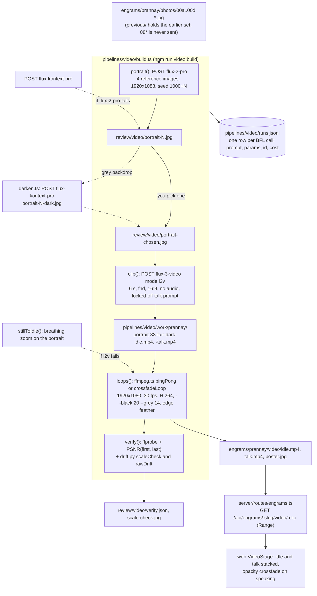

# Video pipeline

The face on the stage is two seamless loops and a poster made from a few reference photos. `pipelines/video/build.ts` sends the photos to Black Forest Labs (BFL) for a studio portrait, animates that portrait twice with FLUX 3 Video, and cuts both clips into 12-second loops with ffmpeg. The server streams the result from `engrams/<slug>/video/`.

The current face is built from `review/video/portrait-33-fair-dark.jpg`: a `flux-2-pro` portrait rendered from Prannay's selfie with a fairer-complexion identity prompt, then given a pure black backdrop by a FLUX Kontext pass. Five rounds of review got there; `review/video/README.md` records each one.

## How the pieces fit



**Figure 1.** From reference photos to the two `<video>` elements on the stage. Dotted arrows are optional passes and fallbacks.

## Output contract

Both loops must look like one continuous take so the stage can crossfade between them at any moment.

| File | Requirement |
|---|---|
| `idle.mp4` | listening: breathing, slow blinks, tiny head motion, eyes on the camera |
| `talk.mp4` | speaking: same framing, light, and subject size, mouth moving, small nods |
| both | H.264 `yuv420p`, 1920x1080, 30 fps, 12 s, no audio track, seamless loop, tagged BT.709 limited range, `+faststart` |
| `poster.jpg` | frame 0 of `idle.mp4`, which is also frame 0 of `talk.mp4` |
| background | one flat value, luma 28 with neutral chroma, which Chrome's video compositor shows as `rgb(11,11,11)`, the page color |
| scale | the face and torso stay within 3% of their frame-0 size through both clips, so the idle to talk crossfade does not pop |

## Before you begin

1. Load the BFL key. The pipeline stops with `BFL_API_KEY missing; source ~/.local/secrets` without it:

   ```bash
   source ~/.local/secrets
   ```

2. Confirm `ffmpeg`, `ffprobe`, and `uv` are on your `PATH`. Homebrew installs the first two with `brew install ffmpeg`. The verify step runs `pipelines/video/drift.py` through `uv run`, which fetches OpenCV on first use.

3. Put clear photos of the face in `engrams/<slug>/photos/` as `.jpg`, named so they sort in order of preference. `refs()` sends them sorted and skips any file starting with `08`. The portrait step uses the first four.

For Prannay the references are four files: `00a-selfie-1156-primary.jpg`, a selfie he supplied as the strongest likeness, `00b-mov2344-smile.jpg` and `00d-mov2344-frontal-neutral.jpg`, the sharpest frontal frames of a 6 s phone clip, and `00c-port-selfie-frontal.jpg` from the original set. The eight photos of the first round live in `photos/previous/`. `engrams/prannay/photos/README.md` records where each one came from and why. Rules that carried over: frontal, sharp, face at least 600 px wide, no phone in front of the face, no second person in a photo that gets sent.

## Build the face

Generation is split into steps so you can look at the portraits before spending on video. Each step is idempotent: raw clips in `pipelines/video/work/<slug>/` are never regenerated by the loops step, so re-cutting loops is free.

1. Render portrait candidates. Each comes back in about 30 s:

   ```bash
   npm run video:build -- prannay --step portrait --candidates 3 --from 35
   ```

   Files land in `review/video/portrait-35.jpg` to `portrait-37.jpg`. Indexes 1 to 34 are taken by earlier rounds; raise `--from` so seeds and filenames do not collide.

2. Open the candidates and pick one. Look for likeness, headroom above the hair, a neutral closed mouth, and a background that is truly dark.

3. Optional: If the backdrop came back grey, replace it with a FLUX Kontext edit that leaves the person untouched. It costs $0.04 and takes about 10 s:

   ```bash
   npx tsx pipelines/video/darken.ts review/video/portrait-35.jpg review/video/portrait-35-dark.jpg
   ```

4. Animate the chosen portrait into an idle clip and a talk clip. Each takes about 110 to 150 s:

   ```bash
   npm run video:build -- prannay --step clips --portrait review/video/portrait-33-fair-dark.jpg --no-loops
   ```

   Raw clips are saved to `pipelines/video/work/prannay/portrait-33-fair-dark-idle.mp4` and `-talk.mp4`, with copies in `review/video/*-raw.mp4`.

5. Cut the loops, write the poster, and verify. The backdrop clamp (`--black 20`) and target level (`--grey 14`) are the defaults:

   ```bash
   npm run video:build -- prannay --step loops --portrait review/video/portrait-33-fair-dark.jpg
   ```

   The command prints the verify report, writes `engrams/prannay/video/{idle.mp4,talk.mp4,poster.jpg}`, and copies everything plus `verify.json` and `scale-check.jpg` into `review/video/`.

6. Check the stage. The server picks up new files without a restart:

   ```bash
   curl -sI http://localhost:4100/api/engrams/prannay/video/idle | head -3
   ```

   Response:

   ```text
   HTTP/1.1 200 OK
   accept-ranges: bytes
   access-control-allow-origin: *
   ```

To do everything in one go with the first portrait candidate, run `npm run video:build -- prannay` (step `all`). Use the split steps when likeness matters.

### Flags

| Flag | Default | Meaning |
|---|---|---|
| `--step` | `all` | `portrait`, `clips`, `idle`, `talk`, `loops`, or `all`. `loops` only re-cuts existing raw clips. |
| `--candidates`, `--from` | `3`, `1` | how many portraits and the first index; seed is `1000 + index` |
| `--portrait` | `review/video/portrait-chosen.jpg` | portrait to animate; its basename tags the raw clips |
| `--seconds` | `6` | i2v clip length; the ping-pong loop doubles it |
| `--resolution` | `fhd` | `hd` (1280x720) or `fhd` (1920x1080) |
| `--loop` | `pingpong` | `pingpong` (forward then reversed) or `xfade` (0.5 s tail-to-head crossfade) |
| `--black` | `20` | clamp every channel to at least N before the backdrop map |
| `--grey` | `14` | RGB level the backdrop floor is mapped to; 14 encodes to luma 28, which Chrome shows as the page's 11 |
| `--no-loops` | | stop after generating clips |

## What each step calls

**Portrait**: `POST https://api.bfl.ai/v1/flux-2-pro` with the prompt in `PORTRAIT_PROMPT`, four `input_image*` fields as base64, `width: 1920`, `height: 1088`, `safety_tolerance: 2`, `output_format: jpeg`, and a fixed seed. If that call fails, the same prompt goes to `flux-kontext-pro` with two reference images and `aspect_ratio: 16:9`.

The prompt describes a chest-up, centered studio portrait with generous headroom, a dark charcoal crew-neck, a bright soft even key light with flattering fill, and a seamless near-black backdrop (`#0b0b0c`) that receives no light. The `IDENTITY` line tells FLUX to match the first reference most closely and names the traits to keep: fair wheatish complexion with an even clean tone, thick dark curly hair, strong dark eyebrows, clean-shaven. That wording came out of rounds 3 and 4, when Prannay asked for a fairer, cleaner base; a Kontext skin-tone edit (`retone.ts`) changed the face too much, so the complexion moved into the prompt instead and the candidate was regenerated with its own seed.

**Backdrop pass** (`darken.ts`): `POST flux-kontext-pro` with the chosen portrait and a prompt that replaces the grey backdrop with `#0b0b0c` and keeps the person exactly as is, seed 7. FLUX.2 drifted to grey on about half the candidates in rounds 2 and 4; this pass fixed `portrait-23`, `portrait-25`, and `portrait-33-fair`.

**Clips**: `POST https://api.bfl.ai/v1/flux-3-video` with `mode: i2v`, one `keyframes` entry (the portrait as base64), `duration: 6`, `resolution: fhd`, `aspect_ratio: 16:9`, `generate_audio: false`. `IDLE_PROMPT` asks for stillness, breathing, and one or two blinks with a static camera. `TALK_PROMPT` opens with a locked-off tripod shot, fixed focal length, no push-in, subject the same size and position from first frame to last, then asks for visible articulation on every word. The locked-off opening was added in round 5 after the previous talk clip zoomed in 19% over six seconds. Raw clips come back 1920x1088 at 24 fps.

All BFL calls go through `generate()` in `bfl.ts`: submit, poll the `polling_url` every 2 s until `Ready` (10 minute timeout), download `result.sample`, then append a row to `pipelines/video/runs.jsonl`. `Error`, `Moderated`, and `Task not found` statuses throw and are logged with `status: error`.

**Loops** (`ffmpeg.ts`): `pingPong` scales and crops to the target size, concatenates the clip with its reverse (dropping the first reversed frame so no frame doubles), and encodes at 30 fps with `libx264 -crf 18 -preset slow`, `+faststart`, and `-an`. Before encoding, `melt()` runs three passes on every frame:

- `lutrgb` clamps each channel to at least `--black` (20), then `colorlevels` maps that floor to `--grey` (14), which turns the slightly blue 9-to-24 backdrop FLUX returns into one flat value.
- A smoothstep alpha mask feathers the outer 12% of the width on each side and the top 16% of the height (cached in `$TMPDIR/engram-edge-<size>.png`), and the clip is composited onto a solid `--grey` frame generated in `rgb24`, so the edges and the interior take the same color path and there is no box around the subject at any viewport ratio.
- The source is tagged `bt709/tv`, the RGB to YUV conversion uses `out_color_matrix=bt709`, and the output carries `color_primaries`, `color_trc`, and `colorspace=bt709`, so browsers do not guess.

Why 14 and not 11: Chrome's video compositor shows limited-range luma darker than the textbook decode. Calibration stripes played through the stage gave luma 25 to 29 as `rgb(7)` to `rgb(14)`; luma 28 lands on `rgb(11)`, the page color. `poster()` extracts frame 0 of the idle loop.

**Verify**: `ffprobe` both loops, extract first and last frames, compute PSNR between them (above 40 dB the loop point is invisible), and run `drift.py` twice. `scaleCheck` matches the upper face of frame 0 against frames at 0, 3, and 6 s of each final at 55 scales, measures the torso width at 93% of the height (the torso is the camera reference; the face box also moves with the head), and writes `review/video/scale-check.jpg` with the boxes drawn. `rawDrift` fits a quadratic trend to the face scale across each raw clip. The current build:

```json
{
  "idle": { "width": 1920, "height": 1080, "fps": 30, "duration": 12.033008, "frames": 361 },
  "talk": { "width": 1920, "height": 1080, "fps": 30, "duration": 12.033008, "frames": 361 },
  "sizeMatch": true,
  "rawDrift": {
    "portrait-33-fair-dark-idle.mp4": { "start": 1.001, "end": 1.013, "max": 1.01 },
    "portrait-33-fair-dark-talk.mp4": { "start": 0.987, "end": 1.008, "max": 1.08 }
  },
  "idleLoopPsnr": 46.20669,
  "talkLoopPsnr": 46.51175
}
```

`scaleCheck` rows are omitted here; they put the face between 1.000 and 1.030 and the torso between 0.991 and 1.008 across both finals, with the eyes at most 19 px off, which is him tilting his head while he talks.

To measure a raw clip by hand:

```bash
uv run pipelines/video/drift.py measure pipelines/video/work/prannay/portrait-33-fair-dark-talk.mp4
```

## Fallback chain

| Stage | First choice | If it fails |
|---|---|---|
| portrait | `flux-2-pro` with 4 references | `flux-kontext-pro` with 2 references, same seed |
| portrait backdrop | dark straight out of FLUX | `darken.ts` Kontext pass, $0.04 |
| idle clip | `flux-3-video` i2v | `stillToIdle()`: an 8 s breathing zoom on the portrait, so the stage still has a face |
| talk clip | `flux-3-video` i2v | copy of `idle.mp4`, so the crossfade is a no-op instead of a glitch |
| serving | `GET /api/engrams/:slug/video/:clip` | `404 {"error":"clip not generated yet: video/idle.mp4"}`; the stage shows the poster with the rebuild command |

## Cost anchors

From `bfl.ts` and the rows in `runs.jsonl`. One BFL credit is $0.01.

| Call | Credits | USD | Wall time |
|---|---|---|---|
| `flux-2-pro` portrait, 1920x1088, 4 references | 10.5 | $0.105 | about 30 s |
| `flux-kontext-pro` edit (`darken.ts`, `retone.ts`) | 4 | $0.04 | about 10 s |
| `flux-3-video` i2v, 6 s, `fhd` | 174 | $1.74 | 110 to 150 s |
| `flux-3-video` estimate per second before the API reports cost (`VIDEO_USD_PER_S`) | | `hd` $0.17, `fhd` $0.30, `qhd` $0.50, `uhd` $0.80 | |

Prannay's face has cost $23.39 across 39 calls, all `Ready`: 22 portraits, 12 clips, and 5 Kontext edits. Every row in `runs.jsonl` carries `costCredits` and `costUsd`, so summing the file is the spend.

## How it got here

| Round | Change | Result | Spend |
|---|---|---|---|
| 1 | Eight Instagram photos, three prompt rounds for a dark backdrop and headroom | `portrait-9` chosen; first loops | $9.64 |
| 2 | References replaced with four frames from a phone clip; `darken.ts` written for grey backdrops | `portrait-23-dark` | $4.30 |
| 3 | Selfie `IMG_1156` becomes the first reference; `IDENTITY` rewritten for a fairer, cleaner look | `portrait-31` | $3.90 |
| 4 | Kontext skin-tone edits drift the face, so complexion moves into the prompt and `portrait-33` is regenerated with seed 1033, then darkened | `portrait-33-fair-dark`, the current base | $3.81 |
| 5 | Talk clip zoom measured with `drift.py`; locked-off talk prompt; `--grey` and BT.709 tagging fix a darker-than-page backdrop and an edge step | current loops, PSNR 46.2 / 46.5 dB | $1.74 |

`review/video/README.md` has the per-candidate notes and the measurements behind each round.

## What it produced


**Figure 2.** `review/video/portrait-chosen.jpg`, a copy of `portrait-33-fair-dark.jpg`: `flux-2-pro` with seed 1033 and the fairer identity prompt, backdrop replaced by the Kontext pass.


**Figure 3.** Frame 0 of `idle.mp4`, also used as `poster.jpg`. The melt and feather have flattened the backdrop to one value.


**Figure 4.** The loop playing on the stage. The video's background disappears into the page.

## Files

| Path | Role |
|---|---|
| `pipelines/video/build.ts` | the CLI: steps, prompts, flags |
| `pipelines/video/bfl.ts` | BFL client: submit, poll, download, `runs.jsonl` logging, cost constants |
| `pipelines/video/ffmpeg.ts` | `probe`, `pingPong`, `crossfadeLoop`, `stillToIdle`, `frame`, `poster`, `psnr`, `edges`, and the `melt` filter chain |
| `pipelines/video/darken.ts` | Kontext backdrop pass: `npx tsx pipelines/video/darken.ts <in.jpg> <out.jpg>` |
| `pipelines/video/retone.ts` | Kontext skin-tone pass (`moderate` or `strong`); tried in round 4, not used |
| `pipelines/video/drift.py`, `drift.ts` | face-scale measurement with OpenCV (`measure`, `compare`) and its TypeScript wrapper |
| `pipelines/video/runs.jsonl` | one row per BFL call |
| `pipelines/video/work/<slug>/` | raw i2v clips, kept between runs |
| `engrams/<slug>/photos/` | input references, with `previous/` for retired sets |
| `engrams/<slug>/video/` | `idle.mp4`, `talk.mp4`, `poster.jpg` served by the API |
| `review/video/` | candidates, raw clips, finals, `verify.json`, `scale-check.jpg`, `index.html` for review, `README.md` with per-round notes |
| `server/routes/engrams.ts` | `GET /api/engrams/:slug/video/:clip` with Range support |
