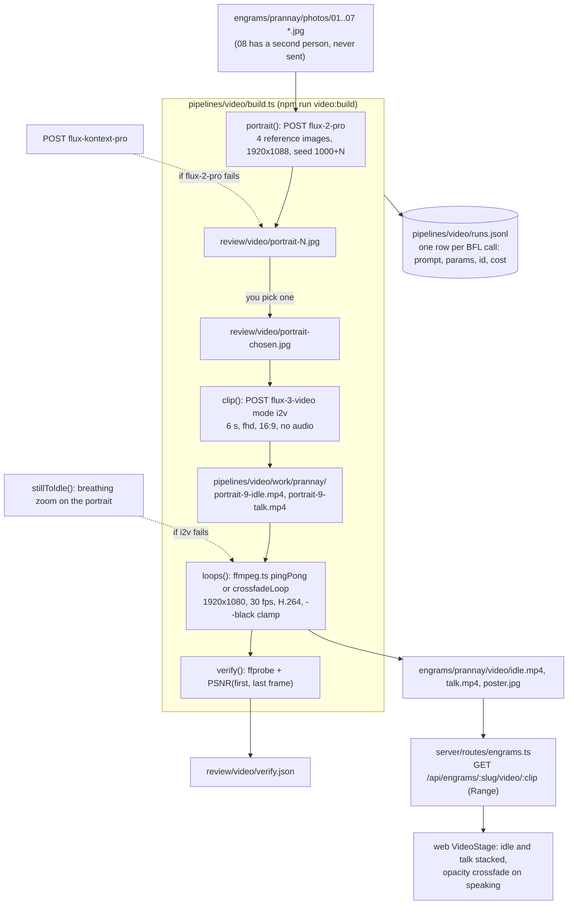
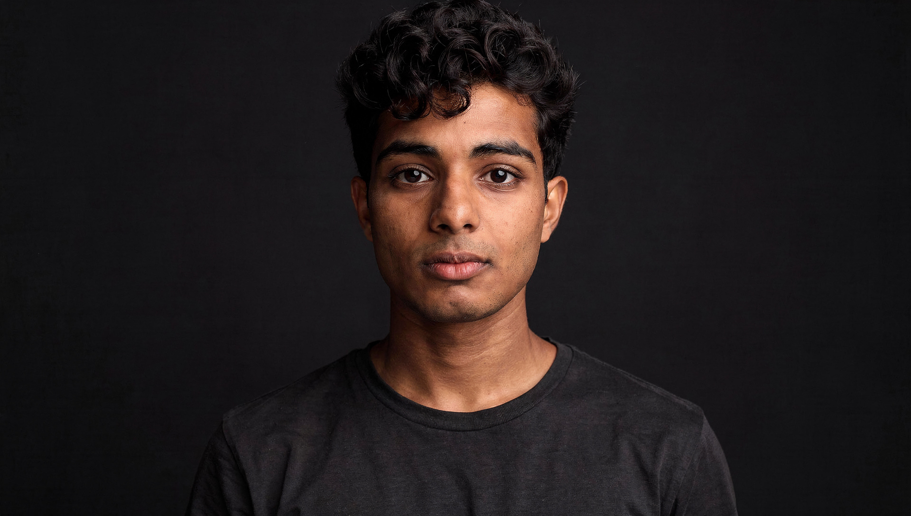
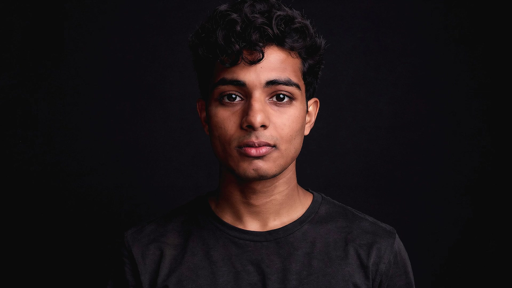
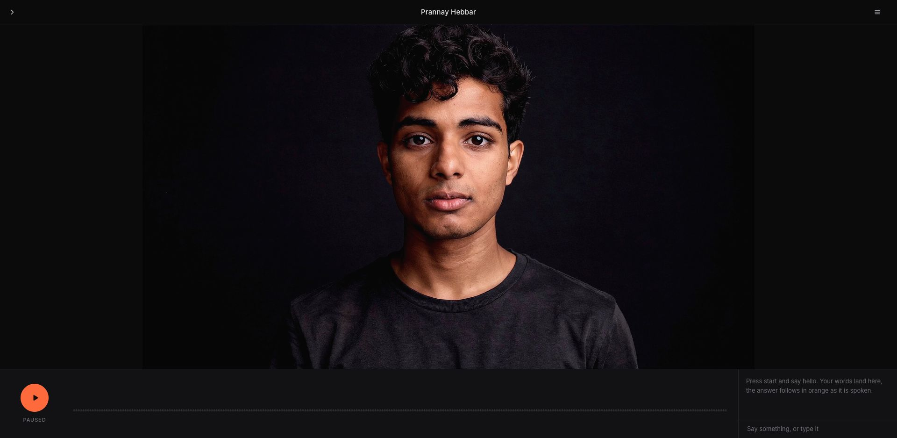

# Video pipeline

The face on the stage is two seamless loops and a poster made from a handful of reference photos. `pipelines/video/build.ts` sends the photos to Black Forest Labs (BFL) for a studio portrait, animates that portrait twice with FLUX 3 Video, and cuts both clips into 12-second loops with ffmpeg. The server streams the result from `engrams/<slug>/video/`.

## How the pieces fit



**Figure 1.** From reference photos to the two `<video>` elements on the stage. Dotted arrows are fallbacks.

## Output contract

Both loops must look like one continuous take so the stage can crossfade between them at any moment.

| File | Requirement |
|---|---|
| `idle.mp4` | listening: breathing, slow blinks, tiny head motion, eyes on the camera |
| `talk.mp4` | speaking: same framing and light, mouth moving, small nods |
| both | H.264 `yuv420p`, 1920x1080, 30 fps, 12 s, no audio track, seamless loop, tagged BT.709 limited range, `+faststart` |
| `poster.jpg` | frame 0 of `idle.mp4`, which is also frame 0 of `talk.mp4` |
| background | near-black studio that decodes to about `rgb(10,10,10)` so it melts into the page's `rgb(11,11,12)` |

## Before you begin

1. Load the BFL key. The pipeline stops with `BFL_API_KEY missing; source ~/.local/secrets` without it:

   ```bash
   source ~/.local/secrets
   ```

2. Confirm `ffmpeg` and `ffprobe` are on your `PATH`. Homebrew installs both with `brew install ffmpeg`.

3. Put 6 to 12 clear photos of the face in `engrams/<slug>/photos/` as `.jpg`, named so they sort in order of preference. `refs()` sends them sorted and skips any file starting with `08`. The portrait step uses the first four.

For Prannay the eight photos were picked from `~/Pictures/Instagram/**`, made upright, and resized to 1536 px on the long side. `engrams/prannay/photos/README.md` records why each one was chosen. Rules that carried over: frontal, sharp, face at least 600 px wide, no phone in front of the face, no second person in a photo that gets sent.

## Build the face

Generation is split into steps so you can look at the portraits before spending on video. Each step is idempotent: raw clips in `pipelines/video/work/<slug>/` are never regenerated by the loops step, so re-cutting loops is free.

1. Render portrait candidates. Three come back in about 30 s each:

   ```bash
   npm run video:build -- prannay --step portrait --candidates 3 --from 1
   ```

   Files land in `review/video/portrait-1.jpg` to `portrait-3.jpg`. To render more, raise `--from` so the seeds and filenames do not collide.

2. Open the candidates and pick one. Look for likeness, headroom above the hair, a neutral closed mouth, and a background that is truly dark. `review/video/README.md` has the notes for the nine Prannay candidates. Number 9 was chosen.

3. Animate the chosen portrait into an idle clip and a talk clip. Each takes about 100 to 160 s:

   ```bash
   npm run video:build -- prannay --step clips --portrait review/video/portrait-9.jpg --no-loops
   ```

   Raw clips are saved to `pipelines/video/work/prannay/portrait-9-idle.mp4` and `portrait-9-talk.mp4`, with copies in `review/video/*-raw.mp4`.

4. Cut the loops, write the poster, and verify. `--black 20` flattens the backdrop onto the page color:

   ```bash
   npm run video:build -- prannay --step loops --portrait review/video/portrait-9.jpg --black 20
   ```

   The command prints the verify report and writes `engrams/prannay/video/{idle.mp4,talk.mp4,poster.jpg}`, plus copies of everything in `review/video/`.

5. Check the stage. The server picks up new files without a restart:

   ```bash
   curl -sI http://localhost:4100/api/engrams/prannay/video/idle | head -3
   ```

   Response:

   ```text
   HTTP/1.1 200 OK
   accept-ranges: bytes
   access-control-allow-origin: *
   ```

To do everything in one go with the first portrait candidate, run `npm run video:build -- prannay` (step `all`). Use the split steps when likeness matters.

### Flags

| Flag | Default | Meaning |
|---|---|---|
| `--step` | `all` | `portrait`, `clips`, `idle`, `talk`, `loops`, or `all`. Any value other than the generation steps only runs the loops on existing raw clips. |
| `--candidates`, `--from` | `3`, `1` | how many portraits and the first index; seed is `1000 + index` |
| `--portrait` | `review/video/portrait-chosen.jpg` | portrait to animate; its basename tags the raw clips |
| `--seconds` | `6` | i2v clip length; the ping-pong loop doubles it |
| `--resolution` | `fhd` | `hd` (1280x720) or `fhd` (1920x1080) |
| `--loop` | `pingpong` | `pingpong` (forward then reversed) or `xfade` (0.5 s tail-to-head crossfade) |
| `--black` | `-1` (off) | clamp every channel to at least N, then map N to the page's 11 |
| `--no-loops` | | stop after generating clips |

## What each step calls

**Portrait**: `POST https://api.bfl.ai/v1/flux-2-pro` with the prompt in `PORTRAIT_PROMPT`, four `input_image*` fields as base64, `width: 1920`, `height: 1088`, `safety_tolerance: 2`, `output_format: jpeg`, and a fixed seed. If that call fails, the same prompt goes to `flux-kontext-pro` with two reference images and `aspect_ratio: 16:9`.

The prompt describes a chest-up, centered studio portrait with generous headroom, a dark charcoal crew-neck, a key light on the face only, and a seamless near-black backdrop (`#0b0b0c`). The identity line names the traits the references share so FLUX keeps them. Three prompt rounds were needed to get a dark enough backdrop and enough headroom; `review/video/README.md` lists what changed each round.

**Clips**: `POST https://api.bfl.ai/v1/flux-3-video` with `mode: i2v`, one `keyframes` entry (the portrait as base64), `duration: 6`, `resolution: fhd`, `aspect_ratio: 16:9`, `generate_audio: false`. `IDLE_PROMPT` asks for stillness, breathing, and one or two blinks with a static camera. `TALK_PROMPT` asks for visible articulation on every word; the first, gentler talk prompt barely moved the mouth, so the pipeline now carries the stronger one. Raw clips come back 1920x1088 at 24 fps.

All BFL calls go through `generate()` in `bfl.ts`: submit, poll the `polling_url` every 2 s until `Ready` (10 minute timeout), download `result.sample`, then append a row to `pipelines/video/runs.jsonl`. `Error`, `Moderated`, and `Task not found` statuses throw and are logged with `status: error`.

**Loops** (`ffmpeg.ts`): `pingPong` scales and crops to the target size, concatenates the clip with its reverse (dropping the first reversed frame so no frame doubles), and encodes at 30 fps with `libx264 -crf 18 -preset slow`, BT.709 tags, `+faststart`, and `-an`. `--black N` adds `lutrgb` to clamp each channel at N and `colorlevels` to map N to 11, which turns the slightly blue 9-to-24 backdrop FLUX returns into a flat `rgb(10,10,10)` in Chrome. `poster()` extracts frame 0 of the idle loop.

**Verify**: `ffprobe` both loops, extract first and last frames, and compute PSNR between them. Above 40 dB the loop point is invisible. The current build:

```json
{
  "idle": { "width": 1920, "height": 1080, "fps": 30, "duration": 12.033008, "frames": 361 },
  "talk": { "width": 1920, "height": 1080, "fps": 30, "duration": 12.033008, "frames": 361 },
  "sizeMatch": true,
  "idleLoopPsnr": 44.203856,
  "talkLoopPsnr": 44.632086
}
```

## Fallback chain

| Stage | First choice | If it fails |
|---|---|---|
| portrait | `flux-2-pro` with 4 references | `flux-kontext-pro` with 2 references, same seed |
| idle clip | `flux-3-video` i2v | `stillToIdle()`: an 8 s breathing zoom on the portrait, so the stage still has a face |
| talk clip | `flux-3-video` i2v | copy of `idle.mp4`, so the crossfade is a no-op instead of a glitch |
| serving | `GET /api/engrams/:slug/video/:clip` | `404 {"error":"clip not generated yet: video/idle.mp4"}`; the stage shows the poster with the rebuild command |

## Cost anchors

From `bfl.ts` and the rows in `runs.jsonl`. One BFL credit is $0.01.

| Call | Credits | USD | Wall time |
|---|---|---|---|
| `flux-2-pro` portrait, 1920x1088, 4 references | 10.5 | $0.105 | about 30 s |
| `flux-3-video` i2v, 6 s, `fhd` | 174 | $1.74 | 100 to 160 s |
| `flux-3-video` estimate per second before the API reports cost (`VIDEO_USD_PER_S`) | | `hd` $0.17, `fhd` $0.30, `qhd` $0.50, `uhd` $0.80 | |

Prannay's face cost $9.64 across 14 calls: 9 portraits and 5 clips, all `Ready`. Every row in `runs.jsonl` carries `costCredits` and `costUsd`, so summing the file is the spend.

## What it produced



**Figure 2.** `review/video/portrait-chosen.jpg`, candidate 9 from `flux-2-pro` with seed 1009. Neutral mouth, full headroom, backdrop level 16 to 18.



**Figure 3.** Frame 0 of `idle.mp4`, also used as `poster.jpg`. The `--black 20` clamp has flattened the backdrop so it matches the page.



**Figure 4.** The loop playing on the stage. The video's background disappears into the page.

## Files

| Path | Role |
|---|---|
| `pipelines/video/build.ts` | the CLI: steps, prompts, flags |
| `pipelines/video/bfl.ts` | BFL client: submit, poll, download, `runs.jsonl` logging, cost constants |
| `pipelines/video/ffmpeg.ts` | `probe`, `pingPong`, `crossfadeLoop`, `stillToIdle`, `frame`, `poster`, `psnr` |
| `pipelines/video/runs.jsonl` | one row per BFL call |
| `pipelines/video/work/<slug>/` | raw i2v clips, kept between runs |
| `engrams/<slug>/photos/` | input references |
| `engrams/<slug>/video/` | `idle.mp4`, `talk.mp4`, `poster.jpg` served by the API |
| `review/video/` | candidates, raw clips, finals, `verify.json`, `index.html` for review, `README.md` with per-candidate notes |
| `server/routes/engrams.ts` | `GET /api/engrams/:slug/video/:clip` with Range support |
