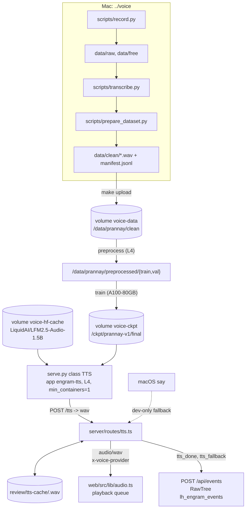

# Voice pipeline

Engram speaks with a copy of Liquid's `LFM2.5-Audio-1.5B` fine-tuned on one person's recordings. You record the person on a Mac, train and serve on Modal, and the Engram server asks the service for one `audio/wav` per spoken sentence. This page follows the audio from the microphone to the stage.

The training and serving code lives in `../voice`. The Engram side is `server/routes/tts.ts` with `server/lib/tts-modal.ts` and `server/lib/tts-local.ts`.

## How the pieces fit



**Figure 1.** Data flow from recording to playback. Solid arrows are the demo path, the dotted arrow is the local fallback.

## How the model learns a voice

`LFM2.5-Audio` has no zero-shot voice cloning. The voice is selected by the system prompt, so fine-tuning teaches the model that `Perform TTS. Use Prannay's voice.` means his voice.

Each training example pairs that system prompt and a sentence with Mimi audio tokens of Prannay reading the sentence (8 codebooks at 12.5 frames per second). A frozen detokenizer turns tokens into 24 kHz audio. `modal_app.py` runs a full fine-tune with `liquid_audio.trainer.Trainer` from `liquid-audio==1.3.0`.

Defaults from `modal_app.py`:

| Setting | Value |
|---|---|
| Base model | `LiquidAI/LFM2.5-Audio-1.5B` |
| Epochs, batch size, learning rate | 8, 16, 5e-5 |
| Context length | 320 tokens |
| Warmup | 10% of steps, at least 5 |
| Validation | once per epoch |
| Intermediate checkpoints | every 2 epochs or 50 steps, deleted once `final/` exists (about 12 GB each) |

The trained `final/` folder is self-contained: `modal_app.py` copies the tokenizer, config, chat template, and `audio_detokenizer` from the base snapshot so `LFM2AudioModel.from_pretrained(Path)` loads it directly.

## Before you begin

1. Install the local tools in the voice folder:

   ```bash
   cd ../voice && make setup
   ```

2. Load the Modal token in every shell you use for training or serving:

   ```bash
   source ~/.local/secrets
   ```

   `MODAL_TOKEN_ID` and `MODAL_TOKEN_SECRET` select the `shared-13706` workspace.

3. Confirm `ffmpeg` is on your `PATH`. `scripts/prepare_dataset.py` and the Modal image both use it.

## Record

Record in a quiet room with the same microphone at the same distance every session. Read exactly what the recorder shows. Clips between 2 and 14 seconds train best. Aim for 45 to 90 minutes of kept audio (about 400 to 800 clips). Twenty minutes gives a rough first result.

1. List microphones and note the index of the one you will use:

   ```bash
   make devices
   ```

2. Record guided sentences from `prompts/sentences.txt`. The session is resumable:

   ```bash
   make record DEVICE=2
   ```

   Enter records, Enter again stops, Enter keeps the take, `r` redoes it, `p` plays it back.

3. Optional: Record 5 to 10 minutes of free talk, and repeat a few times:

   ```bash
   make record-free DEVICE=2
   ```

4. Transcribe and split the free takes at pauses. Skim the transcripts afterwards:

   ```bash
   make transcribe
   ```

5. Trim, normalize, resample to 24 kHz, and split 5% into validation. The command prints stats and a readiness verdict:

   ```bash
   make prepare
   ```

   The result lands in `data/clean/` with a `manifest.jsonl` of `{file, text, split}` rows.

## Train on Modal

Modal runs three stages. `preprocess` tokenizes with `LFM2AudioChatMapper` on an L4, `train` fine-tunes on an A100-80GB, and `synth` renders sample sentences on an L4. `make all` chains them in one detached run.

1. Push the clean dataset to the `voice-data` volume:

   ```bash
   make upload
   ```

2. Run all three stages. The command returns at once and logs stream in the Modal dashboard:

   ```bash
   make all
   ```

   To run stages one at a time use `make preprocess`, `make train`, and `make synth`. To change the run name or epochs pass variables, for example `make train RUN=prannay-v2 EPOCHS=12`.

3. Listen to `samples/prannay-v1/*.wav`. Render more sentences with your own text:

   ```bash
   make synth TEXT="Post-training is where the leverage is right now."
   ```

4. Optional: Pull the checkpoint (about 3 GB) to `checkpoints/prannay-v1`. The Inspect page reads `checkpoints/*/training_args.json` when it exists:

   ```bash
   make download
   ```

To see what is on the volumes at any time, run the CPU-only check stage:

```bash
uv run modal run modal_app.py --stage check
```

It lists each dataset with its clip count and each run with whether `final/` exists. As of 2026-09-25 it prints `volumes are empty`: the `prannay-v1` run has not been trained yet, and the service serves the base voice.

To compare against the stock voice, render the same sentences from the base model:

```bash
uv run modal run modal_app.py --stage synth --run base
```

To test the whole pipeline for a few cents before recording, run `make smoke` (synthetic audio, 3 training steps) and `make clean-smoke` afterwards.

## Serve

`serve.py` deploys the Modal app `engram-tts` with one always-warm L4 container so the stage never waits for a cold start.

1. Deploy the service and write its URL to `../voice/.tts-url`:

   ```bash
   make deploy
   ```

   This runs `uv run modal deploy serve.py` and then `uv run python serve.py url`. The Engram server reads `.tts-url` on every request, so a redeploy needs no restart.

2. Check that the service is up and which voice it will use:

   ```bash
   curl "$(cat ../voice/.tts-url)/health?run=prannay-v1"
   ```

   Response:

   ```json
   {"loaded":["base"],"provider":"modal:base","run":"prannay-v1","run_exists":false,"load_seconds":{"base":27.0},"started":"2026-09-25T20:03:19Z","base_model":"LiquidAI/LFM2.5-Audio-1.5B"}
   ```

   `provider` becomes `modal:prannay-v1` as soon as `/ckpt/prannay-v1/final/model.safetensors` appears on the volume. The service re-checks the volume at most once every 60 seconds (`STAT_TTL_S`).

3. Stop the service when you are done demoing:

   ```bash
   make tts-stop
   ```

How the service behaves:

| Setting | Value |
|---|---|
| GPU, containers | L4, `min_containers=1`, `max_containers=2`, 8 concurrent inputs, scale down after 900 s idle |
| Startup | loads the base model at container start (about 27 s), loads a fine-tuned run on its first request and keeps it in memory |
| Token budget | 40 audio tokens per word, at least 160, at most 1024 |
| Sampling | `audio_temperature=0.8`, `audio_top_k=64` |
| Output | `audio/wav`, 24 kHz, mono, PCM16 |
| Headers | `x-voice-provider` (`modal:<run>` or `modal:base`), `x-voice-requested`, `x-voice-ms`, `x-voice-seconds` |

The service resolves the prompt in `_resolve`: a fine-tuned run uses the request's `system_prompt`, else the prompt stored in `training_args.json`. The base voice always uses `Perform TTS. Use the US male voice.`

## How the Engram server uses it

`POST /api/engrams/:slug/tts` with `{ text, turnId? }` reads `voice.run` and `voice.systemPrompt` from `engrams/<slug>/engram.json`, then calls the Modal service. See [the API reference](api.md#voice) for the route contract.

Test it from the repo root while the dev server is running:

```bash
curl -s -D - -o /tmp/hello.wav -X POST http://localhost:4100/api/engrams/prannay/tts \
  -H 'Content-Type: application/json' \
  -d '{"text":"Hey, this is Prannay. Thanks for coming by."}' | grep -i x-voice
```

Response headers:

```text
x-voice-cache: miss
x-voice-ms: 4295
x-voice-provider: modal:base
```

Details that matter on stage:

- **Cache.** The key is `sha1("<run>\n<text>")`. Hits are served from `review/tts-cache/<key>.wav` with `x-voice-cache: hit` and no Modal call. Results from `local:say` are written but never read back from the cache, so a dev fallback cannot leak into the demo.
- **URL.** `ENGRAM_TTS_URL` overrides `../voice/.tts-url`. Without either, the route fails with `no TTS url: set ENGRAM_TTS_URL or run make deploy in ../voice`.
- **Timeout.** 45 seconds per Modal call, 5 seconds for health.
- **Events.** Every synthesis posts a `tts_done` row (`ms`, `provider`, `chars`, `meta.modalMs`) to `POST /api/events`, and every fallback posts a `tts_fallback` row with the reason in `text`. The Inspect page reads these from RawTree.

### Fallback chain

| Order | Provider | When | What gets logged |
|---|---|---|---|
| 1 | `modal:prannay-v1` | the run's `final/model.safetensors` exists on `voice-ckpt` | `tts_done` |
| 2 | `modal:base` | Modal answered but the run is missing, so `serve.py` used the base voice | `tts_fallback` with `run prannay-v1 not on Modal yet`, then `tts_done` |
| 3 | `local:say` | Modal unreachable or returned an error, on macOS, and `ENGRAM_TTS_LOCAL` is not `0` | `tts_fallback` with the Modal error, then `tts_done`; never served from the cache |
| 4 | none | Modal failed and local is unavailable or disabled | `503 {"error":"no TTS provider available: Modal unreachable and local say disabled"}` |

Set `ENGRAM_TTS_LOCAL=0` on the stage machine so a Modal outage surfaces as an inline error instead of a stranger's voice.


**Figure 2.** What the audience sees while a `/tts` response plays: the voice bar follows the playback analyser and the transcript highlights the sentence being spoken.

## Cost anchors

Modal list prices as noted in `modal_app.py`, `serve.py`, and the `Makefile`:

| Stage | GPU | Cost |
|---|---|---|
| `preprocess`, `synth`, `check` | L4, L4, CPU | cents per run |
| `train` | A100-80GB at about $2.50 per hour | one hour of audio for 8 epochs takes 40 to 60 minutes, about $2 to $3 per run |
| `smoke` | L4 and A100-80GB for 3 steps | cents |
| serve (`engram-tts`) | L4 with `min_containers=1` | about $0.80 per hour while deployed, so run `make tts-stop` after the demo |

Modal has no CLI for the credit balance. Check [the Modal usage page](https://modal.com/settings/usage).

## Files

| Path | Role |
|---|---|
| `../voice/modal_app.py` | Modal stages `check`, `preprocess`, `train`, `synth`, `all`, and the shared image and volumes |
| `../voice/serve.py` | Modal app `engram-tts`: class `TTS` with `POST /tts` and `GET /health` |
| `../voice/Makefile` | every command on this page |
| `../voice/.tts-url` | URL written by `make deploy`, read by the Engram server |
| `../voice/scripts/` | `record.py`, `transcribe.py`, `prepare_dataset.py`, `make_smoke_data.py` |
| `../voice/prompts/sentences.txt` | 733 sentences to read, about 70 minutes |
| `server/routes/tts.ts` | Engram route: cache, fallback chain, events |
| `server/lib/tts-modal.ts`, `server/lib/tts-local.ts` | the Modal client and the macOS `say` fallback |
| `review/tts-cache/` | cached wavs keyed by `sha1(run\ntext)` |
