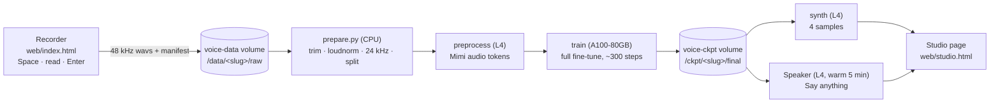

# Voice Studio

Record your voice in the browser, fine-tune Liquid's `LFM2.5-Audio-1.5B` on it, and hear yourself say anything. One Modal app, one command to host.

Hosted copy: **https://hebbarpran--voice-studio.modal.run**. Recording is open to anyone. Training runs on my GPU credits, so it asks for an invite code (DM [@Pran_Ker](https://x.com/Pran_Ker)), or host your own in three commands below and skip the code.



**Figure 1.** Everything to the right of the recorder is `studio.py`'s `pipeline` function chaining the stages already in `modal_app.py`. The browser only ever talks to the `web` function.

## How it works for the person recording

1. Open the studio, press **Start a new voice**. You land on `/v/<slug>/`. That link is the voice: bookmark it, share it, or lose it.
2. Read sentences. Space records, the words light up as Chrome hears them, the take stops on its own, Enter keeps it. The top strip counts minutes. Training unlocks at 10 minutes; 30 sounds like you.
3. Press **Train this voice**. Give it a name (it becomes the prompt `Perform TTS. Use <Name>'s voice.`), and the invite code if the host set one. The run page shows the phase: clean audio, tokenize, fine-tune, first samples. Ten to twenty minutes, all on Modal. You can close the tab.
4. Four samples appear. Type a sentence, press **Say it**. The first one wakes a GPU and takes about a minute; after that, a few seconds.

The prompts are Paul Graham's *How to Do Great Work* split into 733 sentences. Read exactly what is shown, at a natural pace, in a quiet room, same mic throughout.

## Host your own

You need `uv` and a [Modal](https://modal.com) account (the free tier's monthly credits cover several runs).

```bash
uv sync
uv run modal setup        # once: log in
make studio               # deploys studio.py and prints the URL
```

Settings come from the shell that runs `make studio`, so `export` them first (or put them in `~/.local/secrets`):

| Variable | Effect |
|---|---|
| `VOICE_STUDIO_CODES` | Comma-separated invite codes. When set, Train asks for one. Unset means anyone with a link can train on your account. |
| `VOICE_STUDIO_ADMIN` | One extra code that may also start smoke runs (`?max_steps=3` on the train page) and skip the minimum minutes. |
| `VOICE_STUDIO_MIN_MINUTES` | Minutes of kept audio before Train unlocks (10). |
| `VOICE_STUDIO_TARGET_MINUTES` | The goal the recorder shows (30). |
| `VOICE_STUDIO_CONTACT` | Who to ask for a code, shown on the pages. |

`make studio-dev` runs it with live reload, `make studio-url` prints the URL again, `make studio-status` lists the voices on the volumes and whether each has a finished model.

Cost, from Modal list prices: a run on 10 to 30 minutes of audio is 5 to 15 minutes of A100-80GB plus a few minutes of L4, roughly $0.50 to $1.00. The **Say it** GPU scales to zero after five idle minutes. Nothing stays warm.

## What is stored where

```
voice-data  /data/<slug>/raw/         p####.wav, manifest.jsonl, skipped.json   what the recorder writes
            /data/<slug>/clean/       24 kHz clips + manifest                   prepare.py, inside the pipeline
            /data/<slug>/voice.json   {slug, name, created}
            /data/<slug>/status.json  phase log the run page polls
voice-ckpt  /ckpt/<slug>/final/       the fine-tuned model (loads with from_pretrained)
            /ckpt/<slug>/samples/     the four wavs
voice-hf-cache /hf                    base model snapshot, downloaded once
```

A slug is eight hex characters from `secrets.token_hex`. There are no accounts: the link is the key, so treat it like one. To delete a voice, remove `/data/<slug>` and `/ckpt/<slug>` with `modal volume rm`.

## Training details

Each example is (`Perform TTS. Use <Name>'s voice.`, sentence) → Mimi audio tokens (8 codebooks, 12.5 frames/s) of you saying it. The full model is fine-tuned with `liquid_audio.trainer.Trainer`: backbone, audio decoder, encoder and text embedder; the vocoder stays frozen. Learning rate 5e-5, context 320 tokens, 10 % warmup. `studio.plan` picks batch 4/8/16 by dataset size and enough epochs (8 to 30) to reach about 300 optimizer steps, because a first-time recording is short.

Measured on Sept 25, 2026: generation is one autoregressive step per 80 ms frame and runs at about real time on an L4, so a ten-word sentence takes three to four seconds after the model is loaded.

## Layout

```
studio.py             the hosted app: web (FastAPI) + pipeline + Speaker; includes modal_app's functions
modal_app.py          Modal stages: check / preprocess / train / synth / all   (also `make all` from the CLI)
prepare.py            raw -> clean: ffmpeg trim, loudnorm, 24 kHz, val split, stats
takes.py              take storage (wav + manifest + skipped) shared by web/server.py and studio.py
serve.py              streaming TTS endpoint used by the Engram stage (../engram)
web/index.html        the recorder (one file, Chrome for word highlighting)
web/studio.html       train / run / listen page
web/landing.html      start page
web/server.py         the same recorder against a local folder (make web), stdlib only
web/qa/e2e.mjs        Playwright e2e with a fake mic: node web/qa/e2e.mjs  (server on :4311)
scripts/              terminal recorder, whisper splitter, prepare CLI, smoke data
prompts/sentences.txt what to read
```

## The CLI path (no browser hosting)

The same pipeline from the terminal, on your laptop plus your Modal account:

```bash
make web                     # recorder at http://127.0.0.1:4300, writes data/raw
make prepare                 # data/raw -> data/clean, prints a readiness verdict
make upload && make all      # Modal: preprocess -> train -> synth, run prannay-v1
make synth TEXT="..."        # more samples -> samples/<run>/
make deploy                  # serve.py: streaming /tts for the Engram stage; make tts-stop when done
```

`make smoke` runs the whole Modal pipeline on synthetic tones for a few cents. Other inputs: `make record-free` then `make transcribe` splits a free-talk take with local Whisper.

## Sources

- https://github.com/Liquid4All/liquid-audio (Trainer, LFM2AudioChatMapper, Jenny TTS example)
- https://huggingface.co/LiquidAI/LFM2.5-Audio-1.5B
- https://github.com/Liquid4All/cookbook/tree/main/examples/voice-assistant (Modal A100 fine-tune reference)
