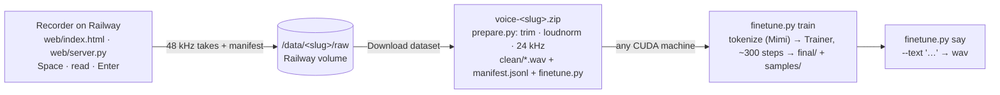

# Voice Studio

Record a dataset of your voice in the browser, download it, and fine-tune Liquid's `LFM2.5-Audio-1.5B` on it with one script on any GPU. Then type anything and hear it back as you.

Hosted recorder: **https://voice-studio-production-f01a.up.railway.app**. Open to anyone; recording and the download are free. Training is your own GPU and your own bill, which is why nothing here needs an account or a code.



**Figure 1.** The hosted part is only the recorder and the export. Everything that needs a GPU runs where you run it.

## The steps, as you would post them

1. **Open the recorder, press Start a new voice.** You get a link like `/v/8f3a19c2/`. That link is the voice: bookmark it, share it, come back to it. Use Chrome or Edge so the words light up as you read.
2. **Read.** Space records, the take stops when you finish the sentence, Enter keeps it and arms the next one. The top strip counts minutes. Ten minutes is the practical minimum; thirty sounds like you. Quiet room, same mic, natural pace, read exactly what is shown.
3. **Download.** Press Download & train, give the voice a name, press Download dataset. The zip holds your clips cleaned to 24 kHz, a `manifest.jsonl` with each clip's text, and `finetune.py`.
4. **Get a GPU.** A full fine-tune of the 1.5B model wants about 40 GB of GPU memory at batch 16: an A100-80GB or H100 on any cloud. A 24 GB card works with `--batch 4`. Ten minutes of audio is about ten minutes on an A100.
5. **Train.**
   ```bash
   pip install "liquid-audio==1.3.0" soundfile
   unzip voice-8f3a19c2.zip
   python finetune.py train --data voice-8f3a19c2 --name "Prannay"
   ```
   The script tokenizes the clips into Mimi audio tokens, fine-tunes with Liquid's `Trainer`, writes `ckpt/Prannay/final/` and four sample wavs in `ckpt/Prannay/samples/`.
6. **Say anything.**
   ```bash
   python finetune.py say --ckpt "ckpt/Prannay/final" --text "Hey, this is Prannay. It worked."
   ```

Sounds off? Record more at the same link and re-download, or add `--epochs 20`. Under ten minutes of audio the voice is recognisable but rough.

## How the fine-tune works

Each training example is (`Perform TTS. Use <Name>'s voice.`, sentence) → Mimi audio tokens (8 codebooks, 12.5 frames/s) of you saying that sentence. There is no zero-shot cloning in this model, so the name in the prompt is what the fine-tune teaches it to honor. The full model is trained with `liquid_audio.trainer.Trainer`: backbone, audio decoder, encoder and text embedder; the vocoder stays frozen. Learning rate 5e-5, context 320 tokens, 10 % warmup. `finetune.plan` picks batch 4/8/16 by dataset size and enough epochs (8 to 30) to reach about 300 optimizer steps, because a first recording is short.

Measured on Sept 25, 2026: generation is one autoregressive step per 80 ms frame and runs at about real time on an L4, so a ten-word sentence takes three to four seconds once the model is loaded.

## Host the recorder yourself

`Dockerfile` is the whole thing: Python 3.12 slim plus ffmpeg, no other dependencies. Any Docker host works; on Railway:

```bash
railway init -n voice-studio
railway up -s voice-studio --ci
railway domain -s voice-studio
```

Then attach a volume at `/data` (dashboard, or the `volumeCreate` GraphQL mutation; the CLI's `volume add` currently panics on a fresh service). Every voice lives under `/data/<slug>/`: `raw/` takes, `clean/` the last export, `voice-<slug>.zip`. Without a volume the recordings vanish on the next deploy. `/health` reports `persistent: true` when the mount is there.

| Variable | Effect |
|---|---|
| `VOICE_DATA_DIR` | Where voices live (`/data` in the image). Unset means single-user local mode (`make web`). |
| `VOICE_MIN_MINUTES` | When the recorder's Train link turns orange (10). |
| `VOICE_TARGET_MINUTES` | The goal the recorder shows (30). |
| `VOICE_CONTACT` | A handle to show on the pages. |
| `VOICE_REPO` | Source link in the footer. |

Locally: `make web-hosted` runs the same multi-voice server at `http://127.0.0.1:4300` with `data/voices/` as the data dir; `make web` is the one-voice mode the CLI pipeline below uses.

## What is in the zip

```
voice-<slug>/README.txt          the stats and the two commands
voice-<slug>/clean/manifest.jsonl {"file","text","duration_s","source","split"} per clip; 5 % val
voice-<slug>/clean/p0000.wav      24 kHz mono 16-bit, silence trimmed, loudness-normalized, 1-14 s
voice-<slug>/finetune.py          the training script
```

## Layout

```
web/server.py         the server: local one-voice mode or hosted multi-voice mode (VOICE_DATA_DIR); stdlib only
web/index.html        the recorder (one file, Chrome for word highlighting)
web/landing.html      start page
web/train.html        download + the training steps with your slug and name filled in
web/qa/e2e.mjs        Playwright e2e with a fake mic: node web/qa/e2e.mjs  (server on :4311)
takes.py              take storage: wav + manifest + skipped
prepare.py            raw -> clean: ffmpeg trim, loudnorm, 24 kHz, val split, stats
finetune.py           train / say on any CUDA machine (liquid-audio Trainer)
Dockerfile            the hosted recorder
prompts/sentences.txt what to read (Paul Graham, How to Do Great Work, 733 sentences)
scripts/              terminal recorder, whisper splitter, prepare CLI, smoke data
modal_app.py, serve.py  the Engram stage's own training + streaming TTS on Modal (../engram); not part of the tool
```

## The Engram stage path

The talking-portrait demo in `../engram` uses the same recordings but trains and serves on Modal so the stage can stream sentences: `make web`, `make prepare`, `make upload && make all`, `make deploy` (see `modal_app.py`, `serve.py`, and `../engram/docs/voice-pipeline.md`). `make smoke` runs that pipeline on synthetic tones for a few cents.

## Sources

- https://github.com/Liquid4All/liquid-audio (Trainer, LFM2AudioChatMapper, Jenny TTS example)
- https://huggingface.co/LiquidAI/LFM2.5-Audio-1.5B
- https://github.com/Liquid4All/cookbook/tree/main/examples/voice-assistant (A100 fine-tune reference)
